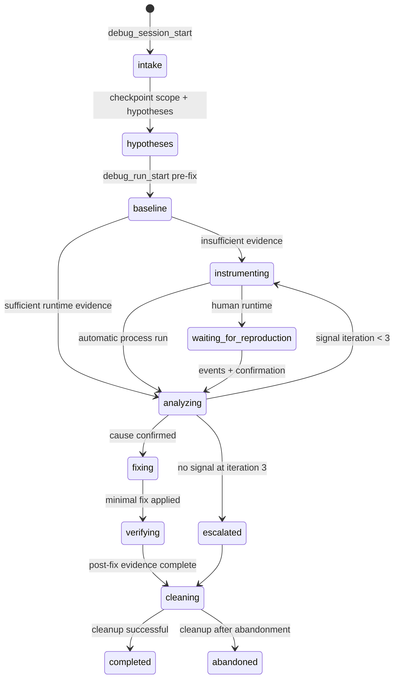
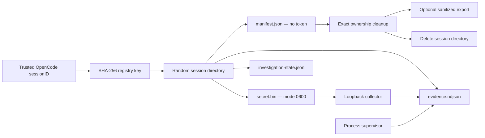

# Implementation Plan: OpenCode Debug Mode

**Created**: 2026-07-13
**Status**: Implemented
**Input**: Feature specification from `/Volumes/dev/opencode-debug-mode/.sdd/.current/spec.md`
**Model**: GPT-5 (Codex), high reasoning effort
**User Input**: Greenfield MIT npm package `opencode-debug-mode`; OpenCode >=1.17; Node.js >=20; explicit `debug` agent and `/debug`; CLI/process capture plus authenticated loopback HTTP collector only; deterministic cleanup and durable compact investigation state; preserve future backend seams without implementing future backends.

## Summary

Build one TypeScript ESM OpenCode plugin package that registers the `debug` primary agent, routes `/debug` to that agent, and exposes a small structured tool API. The runtime is session-scoped by OpenCode's trusted `ToolContext.sessionID`, stores evidence and a revisioned investigation checkpoint in a random OS-temporary directory, and has two v1 evidence transports:

1. a supervised child-process backend that streams bounded stdout/stderr and structured probe records; and
2. an on-demand Node HTTP server bound to `127.0.0.1` on an OS-selected port, with a 256-bit bearer token, strict route/schema/size limits, CORS only for ingestion, and no HTTP evidence-reading endpoint.

The plugin never returns the bearer token in a tool result. Browser and extension runtimes use an exact-hash-owned temporary transport helper generated by the plugin; CLI probes need no token and emit a reserved structured line prefix into the captured process. The agent performs probe edits through normal OpenCode source-edit tools, while the plugin verifies and inventories exact marker blocks. Cleanup removes only exact owned blocks/files/permission entries, stops process trees and listeners, optionally exports a sanitized bundle, and then deletes the session directory. A watchdog supervisor handles parent crashes; startup recovery handles expired manifests and partial file cleanup.

No unresolved planning questions remain. The implementation assumptions below resolve choices that the greenfield specification intentionally left open.

## Technical Context

**Language/Version**: TypeScript 7.0.2, ESM output targeting Node.js 20; public runtime engine `>=20`

**Primary Dependencies**: `@opencode-ai/plugin` peer dependency `>=1.17.0 <2`; `zod` 4.4.3 for persisted/untrusted schemas; `jsonc-parser` 3.3.1 for minimal extension-manifest edits; Node built-ins for HTTP, crypto, child processes, streams, and files

**Build Tooling**: `tsup` 8.5.1 with two ESM entries (`index` and `process-supervisor`); `@biomejs/biome` 2.5.3 for formatting/lint; npm lockfile and scripts

**Storage**: Per-session files under `os.tmpdir()/opencode-debug-mode-v1/session-*`: `manifest.json`, mode-0600 `secret.bin`, `investigation-state.json`, and `evidence.ndjson`; optional sanitized export to a user-selected destination

**Testing**: Vitest 4.1.10 with V8 coverage; real child-process and HTTP integration tests; package-install smoke tests against OpenCode 1.17.0 and latest 1.x; GitHub Actions on Ubuntu, macOS, and Windows

**Target Platform**: OpenCode >=1.17, Node.js >=20, macOS/Linux/Windows

**Project Type**: Single publishable npm plugin repository

**Performance Goals**: collector ready or actionable failure within 2 seconds; resource cleanup within 5 seconds after in-flight work settles; streaming rather than buffered process output; no more than 64 KiB/request, 8 KiB/scalar, 25,000 events, 25 MiB evidence, 256 KiB checkpoint

**Constraints**: loopback only; no telemetry; token never in checkpoints/manifests/reports/tool output/retained bundles; no whole-file restoration; no runtime identifier becomes a path; maximum three no-signal iterations; JavaScript/TypeScript probes only; explicit activation only

**Scale/Scope**: One active debug investigation per trusted OpenCode session, many isolated concurrent sessions per plugin instance, up to 100 events per HTTP batch and 25,000 persisted/sampled events per session

## Assumptions and Locked Decisions

- npm is the repository package manager because the deliverable is a public npm package and `npm pack --dry-run` is the release acceptance check.
- The plugin claims configuration keys `agent.debug` and `command.debug`. If a pre-existing value is present, it emits an actionable OpenCode app warning and installs the package-owned definition; silently merging a foreign prompt could weaken the safety policy.
- `config.command.debug.template` is `$ARGUMENTS` and `agent` is `debug`; the workflow exists only in `assets/debug-agent.md`.
- Public tools return a JSON string matching `ToolResultEnvelope<T>`. No public result contains absolute session storage paths, raw bearer tokens, or unsanitized evidence.
- A raw OpenCode session ID is never persisted. The registry key and manifest contain `sha256("opencode-debug-mode:v1:" + ToolContext.sessionID)`.
- `secret.bin` is the only persisted bearer-token copy. It is created with mode `0o600`, never exported, and exists only to permit an interrupted OpenCode task to resume. On platforms where ACL semantics differ, the isolated OS temp directory and current-user ownership remain the security boundary.
- A command is passed as `executable` plus `args[]`; v1 never enables `shell: true`. Environment overrides are an allowlisted object and secret-looking values are not persisted.
- The process backend runs the target below a package-owned Node supervisor. Loss of the plugin IPC channel triggers descendant-tree termination. This is the primary crash guarantee; startup recovery never kills a recycled PID that it cannot verify.
- `127.0.0.1` is the default collector host. If IPv4 loopback cannot bind, startup may explicitly try `::1`; it never passes an omitted host, `0.0.0.0`, or `::` to `listen()`.
- Unauthenticated `OPTIONS /v1/events` is permitted because browser preflights cannot carry the bearer credential. It returns no session data and allows only `POST`, `Authorization`, and `Content-Type`. `POST /v1/events` and `GET /v1/health` require the bearer token.
- A validated request origin is echoed with `Vary: Origin`; `Access-Control-Allow-Credentials` is never sent. Health has no CORS headers.
- Control fields over 8 KiB are rejected. Values inside `data` are recursively truncated/redacted with metadata so valid observations can still be persisted.
- Process and HTTP events share one canonical NDJSON schema. A serialized writer queue prevents interleaving; a trailing partial line after a crash is ignored and surfaced as a recovery warning.
- An explicit `waiting_for_reproduction` checkpoint grants a waiting lease that suppresses idle expiry. The lease ends on the next agent action, session deletion, cleanup, or plugin disposal.
- The cleanup tool may run a caller-supplied clean-build command after source cleanup. The five-second success metric applies to owned resource teardown; the project check has its own bounded timeout and is reported separately.
- Git is optional. If present, the plugin snapshots porcelain status at start and compares it at cleanup; correctness never depends on a globally clean working tree.

## Research

### OpenCode plugin surface

OpenCode npm plugins are configured through the `plugin` array, receive a `config` hook, can add custom tools, receive trusted tool context including `sessionID`, `directory`, `worktree`, and `abort`, and expose `event`, `dispose`, and compaction hooks. The current `@opencode-ai/plugin` 1.17.19 declarations confirm `config.agent`, `config.command`, `tool`, `event`, `dispose`, `experimental.session.compacting`, and an abort signal on every tool call. Therefore this feature should be one npm plugin rather than copied global agent/command files. Sources: [OpenCode plugins](https://opencode.ai/docs/plugins/), [custom tools](https://opencode.ai/docs/custom-tools/), [agents](https://opencode.ai/docs/agents/), and [commands](https://opencode.ai/docs/commands/).

The config hook is the only policy source: `agent.debug.prompt` loads the packaged Markdown asset, and `command.debug` supplies only routing. The compaction hook injects a short instruction to call `debug_state_read`; it does not copy the checkpoint into context.

### Node process supervision

Node `spawn()` supports argument arrays, streaming stdio, `AbortSignal`, timeouts, and detached process groups. Detached groups alone are insufficient for reliable parent-crash cleanup on every OS, so a small Node supervisor owns the target, listens for IPC disconnect, and performs graceful then forced tree termination. POSIX uses a new process group plus `process.kill(-pid, signal)`; Windows uses `taskkill /PID <pid> /T` followed by `/F`, invoked as an executable without a shell. Source: [Node child_process](https://nodejs.org/api/child_process.html).

The supervisor receives the command over IPC so secrets and arbitrary arguments do not appear in its argv. The manifest stores only a sanitized command summary, supervisor PID, target PID, owner nonce hash, and timestamps. Restart recovery relies on the watchdog and only reports a still-live unverified PID instead of risking termination of an unrelated recycled process.

### Atomic temporary storage

Node provides cross-platform `mkdtemp`, `rename`, and recursive `rm`. Session directory names are generated by `mkdtemp`; neither OpenCode nor runtime IDs become path segments. Atomic JSON updates write a sibling `*.next-<random>` file, validate byte size, `sync()` the handle, close it, then `rename()` over the destination. Reads validate schema and revision. Source: [Node fs/promises](https://nodejs.org/api/fs.html).

### Collector hardening

Node's HTTP server exposes request, header, keep-alive, and connection shutdown controls. The server sets short nonzero header/request timeouts, a small maximum-header count, rejects an oversized `Content-Length` before reading, counts streamed bytes, drains then destroys oversized requests, and closes active sockets during bounded cleanup. Source: [Node HTTP](https://nodejs.org/api/http.html).

Tokens use 32 bytes from `randomBytes`; comparisons hash both candidates to fixed-size buffers before `timingSafeEqual`, avoiding the unequal-length exception and minimizing timing differences. Source: [Node 20 crypto](https://nodejs.org/download/release/latest-v20.x/docs/api/crypto.html).

### Package and test strategy

The npm `files` allowlist and `exports` map limit published contents; `npm pack --dry-run` is the authoritative package-content check. CI publication is out of scope, but release documentation recommends trusted publishing/provenance when the maintainer later enables it. Sources: [npm package.json](https://docs.npmjs.com/files/package.json/), [npm publish](https://docs.npmjs.com/cli/publish/), and [npm trusted publishing](https://docs.npmjs.com/trusted-publishers/).

The unscoped package name `opencode-debug-mode` was available when this plan was finalized on 2026-07-13; the release checklist must query npm again immediately before the first publish because name availability is external state. The repository directory and npm package use the same name.

Vitest V8 coverage works without adding application instrumentation. Coverage is a quality gate for this package only; target projects use their own build/type/lint commands. Source: [Vitest coverage](https://main.vitest.dev/guide/coverage.html).

## Entities

### DebugSession

- **Fields**: `schemaVersion: 1`, `sessionId: OpaqueId`, `trustedSessionHash: HexSha256`, `projectRoot: absolute real path`, `directory: absolute real path`, `status: active|cleaning|cleaned|partial`, `createdAt`, `lastActivityAt`, `expiresAt`, `waitingForReproduction`, `keepArtifacts`, optional `retentionDestination`, `collector`, `processes`, `runs`, `probes`, `ownedFiles`, `permissionChanges`, `counters`, `cleanup`.
- **Relationships**: owns one secret, one checkpoint, one evidence store, zero/one collector, and many runs/probes/processes.
- **Validation**: derives only from trusted tool context; one active session per trusted session hash; project paths are canonical; runtime IDs cannot alter storage paths.
- **States**: `active -> cleaning -> cleaned`; any cleanup subfailure yields `partial`; repeated cleanup of `cleaned` is `already-clean`.

### InvestigationState

- **Fields**: `schemaVersion`, monotonic `revision`, problem/behavior/runtime/reproduction/success summaries, `phase`, `loopIteration`, ranked hypotheses, completed checks, runs/probe references, deciding evidence IDs, developer confirmations, decisions, `nextAction`, instrumented/fixed files, and cleanup progress.
- **Relationships**: belongs to one DebugSession; references evidence IDs but never embeds raw event data.
- **Validation**: <=256 KiB serialized; no token field; bounded strings/arrays; IDs use the opaque-ID grammar; full-schema validation before atomic replace.
- **States**: `intake -> hypotheses -> baseline -> instrumenting|waiting_for_reproduction -> analyzing -> fixing -> verifying -> cleaning -> completed|abandoned|escalated`. A stale `expectedRevision` is rejected without writing.

### Hypothesis

- **Fields**: `id`, `rank: 1..4`, `statement`, `confirmationSignals[]`, `eliminationSignals[]`, `status: open|confirmed|eliminated`, `evidenceRefs[]`, optional `invalidatedBy`.
- **Relationships**: referenced by runs, probes, checks, and evidence.
- **Validation**: two to four hypotheses unless `singleCauseEvidenceRef` is present; only evidence-backed transitions may set confirmed/eliminated.
- **States**: `open -> confirmed|eliminated`; a later invalidating change returns it to `open` and records why.

### Run

- **Fields**: `id`, `label: pre-fix|post-fix`, `status: planned|running|waiting|completed|failed|timed_out|cancelled`, reproduction summary/confirmation, timestamps, optional process result, `evidenceRefs[]`.
- **Relationships**: belongs to a session and groups processes, probes, and events.
- **Validation**: ID is plugin-generated; every event references a registered active/completed run.
- **States**: `planned -> running|waiting -> completed|failed|timed_out|cancelled`.

### Probe

- **Fields**: plugin-generated `id`, `runId`, `hypothesisId`, source location, message, transport, capture paths, sampling policy, exact start/end markers, expected block/hash, registration status, optional owned transport helper.
- **Relationships**: belongs to one run/hypothesis and may own one exact helper file.
- **Validation**: JS/TS only; capture expressions are identifier/property paths, never raw arbitrary code; source event fields must match registration.
- **States**: `planned -> registered -> validated -> active -> removed|ambiguous`.

### EvidenceEvent

- **Fields**: `schemaVersion`, generated `eventId`, `receivedAt`, runtime `timestamp`, `sessionId`, `runId`, `runLabel`, `hypothesisId`, `probeId`, `kind`, `message`, sanitized `data`, registered `source`, and `sanitization` flags.
- **Relationships**: immutable NDJSON record linked to registered entities.
- **Validation**: bounded, redacted, and sanitized before append; source and control fields come from/agree with the manifest.
- **States**: accepted, sampled, truncated, dropped, or rejected; counters record every outcome.

### Collector

- **Fields**: `host`, `port`, `status: stopped|starting|ready|draining|failed`, timestamps, socket set, request count, accepted/rejected/sampled/truncated/dropped counters; token is held separately.
- **Relationships**: belongs to one DebugSession and writes only through its EvidenceStore.
- **Validation**: host is exactly `127.0.0.1` or `::1`; port comes from the bound socket; all non-OPTIONS routes authenticate.
- **States**: `stopped -> starting -> ready -> draining -> stopped`; startup/runtime errors transition to `failed` and trigger cleanup.

### OwnedProcess

- **Fields**: `id`, `runId`, sanitized command summary, supervisor PID, target PID, nonce hash, timestamps, status, exit code, signal, timeout, output byte/event counts, termination outcome.
- **Relationships**: owned by one session/run and one supervisor.
- **Validation**: command uses executable plus args; cwd remains inside user-authorized project scope; env is bounded and not persisted raw.
- **States**: `starting -> running -> exited|timed_out|cancelled|terminated|failed`.

### CleanupManifest

- **Fields**: package/schema marker, internal session ID, trusted-session hash, canonical roots, lifecycle times, state revision, and authoritative inventories for collectors, supervisors, exact marker blocks, generated helper hashes, extension permission entries, and temp artifacts.
- **Relationships**: persisted representation of DebugSession ownership.
- **Validation**: strict schema; manifest file must be inside the package temp base; referenced source paths must remain under the canonical project root; no bearer token or raw evidence.
- **States**: revisioned atomically on every ownership change; cleanup writes per-resource results before deleting the directory.

### RetainedEvidenceBundle

- **Fields**: sanitized `evidence.ndjson`, `investigation-state.json`, `report.md`, and `bundle-manifest.json` with schema/version/counts/hashes.
- **Relationships**: optional export derived from one session.
- **Validation**: new unique directory below an explicit real destination; post-export secret scan; never includes `secret.bin`, internal cleanup manifest, unsanitized data, or ephemeral ownership details.

## Contracts

### HTTP collector

The normative REST contract is [`contracts/collector.openapi.yaml`](./contracts/collector.openapi.yaml).

| Method | Path | Authentication | Purpose |
| --- | --- | --- | --- |
| `OPTIONS` | `/v1/events` | None | Minimal ingestion preflight; no data or credentials |
| `POST` | `/v1/events` | Bearer | Validate, sanitize, and append a batch of 1..100 events |
| `GET` | `/v1/health` | Bearer | Return only `ready` or `draining` |

All other routes/methods fail. HTTP never lists, reads, downloads, or deletes evidence.

### OpenCode tool result envelope

Every tool returns this shape serialized as JSON:

```ts
export type ToolResultEnvelope<T> =
  | { ok: true; data: T; warnings: ToolWarning[] }
  | {
      ok: false
      error: {
        code: DebugErrorCode
        message: string
        retryable: boolean
        action?: string
        details?: Record<string, string | number | boolean>
      }
    }
```

The stable v1 tool set is:

| Tool | Required input | Success data | Important errors |
| --- | --- | --- | --- |
| `debug_session_start` | `keepArtifacts`, optional explicit `retentionDestination` | public session ID, lifecycle state, limits, capability flags | `SESSION_EXISTS`, `DESTINATION_REQUIRED`, `NODE_UNSUPPORTED`, `STORAGE_UNAVAILABLE` |
| `debug_session_status` | none | lifecycle/phase/revision, collector/process/probe counts, limits/counters; no token/path | `NO_ACTIVE_SESSION`, `SESSION_OWNERSHIP_MISMATCH` |
| `debug_state_read` | none | validated checkpoint plus recovery warnings | `NO_ACTIVE_SESSION`, `STATE_MISSING`, `STATE_INVALID`, `STATE_VERSION_UNSUPPORTED` |
| `debug_state_checkpoint` | `expectedRevision`, complete validated `state` without revision | new revision and byte count | `STALE_REVISION`, `STATE_TOO_LARGE`, `STATE_INVALID` |
| `debug_run_start` | `label`, reproduction summary, optional `waitingForUser` | plugin-generated run ID and status | `INVALID_PHASE`, `RUN_LIMIT` |
| `debug_process_capture` | run ID, purpose, probe IDs, executable, args, cwd, bounded env, timeout | exit/timing/timeout/signal/output/evidence summary | `RUN_NOT_FOUND`, `PROBE_NOT_VALIDATED`, `COMMAND_REQUIRES_APPROVAL`, `PROCESS_START_FAILED`, `PROCESS_TIMEOUT` |
| `debug_collector_start` | optional `transportTargetPath`, runtime kind | public collector ID/host/port/status and helper import reference; no token | `LOOPBACK_BIND_FAILED`, `COLLECTOR_EXISTS`, `HELPER_PATH_UNSAFE` |
| `debug_probe_prepare` | run/hypothesis/source/message, safe capture paths, transport/sampling | plugin-generated probe ID, exact marker block, required import/permission guidance | `UNSAFE_CAPTURE`, `UNSUPPORTED_LANGUAGE`, `COLLECTOR_REQUIRED` |
| `debug_probe_register` | probe ID and optional exact extension permission entries | verified marker/helper/permission ownership summary | `MARKER_MISSING`, `MARKER_MISMATCH`, `PERMISSION_MISMATCH` |
| `debug_evidence_read` | filters and cursor/limit | bounded event page, next cursor, counters, trailing-line warning | `FILTER_INVALID`, `EVIDENCE_UNAVAILABLE` |
| `debug_cleanup` | reason, structured final report, optional clean-check command | per-resource results, clean-check result, retained path if any, remaining-artifact scan | `CLEANUP_PARTIAL`, `EXPORT_FAILED`; always continues other teardown |

All tool implementations call `registry.requireOwned(context.sessionID)`; no input parameter can select another session.

## State and Ownership Flows





## File Structure

Line ranges in tasks are planned ranges for a greenfield tree; use the named symbol as the stable edit anchor if preceding tasks shift a range.

| File | Action | Responsibility |
| --- | --- | --- |
| `package.json` | Create | Package metadata, peer/runtime/dev dependencies, scripts, exports, files allowlist |
| `package-lock.json` | Generate | Reproducible npm dependency graph |
| `tsconfig.json` | Create | Strict Node20 ESM compiler configuration |
| `tsup.config.ts` | Create | Plugin and supervisor ESM build entries |
| `vitest.config.ts` | Create | Unit/integration configuration and coverage gates |
| `biome.json` | Create | Formatting and lint rules |
| `.gitignore` | Create | Ignore node/build/coverage and local debug artifacts |
| `src/index.ts` | Create | Public plugin export only |
| `src/plugin.ts` | Create | Compose dependencies, hooks, tools, config registration, disposal |
| `assets/debug-agent.md` | Create | Single complete hypothesis-driven agent policy |
| `src/core/constants.ts` | Create | Schema versions, limits, prefixes, timeouts |
| `src/core/errors.ts` | Create | Stable error codes and structured errors |
| `src/core/result.ts` | Create | Machine-readable success/error envelope |
| `src/core/schemas.ts` | Create | Shared opaque IDs, paths, timestamps, counters |
| `src/core/clock.ts` | Create | Injectable wall/monotonic clock |
| `src/session/types.ts` | Create | Session, manifest, owned-resource types |
| `src/session/paths.ts` | Create | Canonical roots and containment checks |
| `src/session/atomic-json.ts` | Create | Size-bounded fsync/rename JSON persistence |
| `src/session/manifest-store.ts` | Create | Strict manifest read/update/revision operations |
| `src/session/secret-store.ts` | Create | Mode-0600 token create/read/delete |
| `src/session/registry.ts` | Create | Trusted-session scoping, rehydration, leases, isolation |
| `src/session/orphan-recovery.ts` | Create | Verify and clean expired package manifests |
| `src/investigation/schema.ts` | Create | Full checkpoint Zod schema and 256 KiB guard |
| `src/investigation/store.ts` | Create | Revision-CAS checkpoint reads/writes/recovery results |
| `src/evidence/types.ts` | Create | Canonical input/persisted event schemas and filters |
| `src/evidence/sanitize.ts` | Create | Secret redaction, depth/collection bounds, cycle/binary handling |
| `src/evidence/store.ts` | Create | Serialized NDJSON append, limits, counters, partial-line recovery |
| `src/evidence/read.ts` | Create | Local filtered pagination and keyword search |
| `src/run/service.ts` | Create | Registered pre/post runs and waiting state |
| `src/process/protocol.ts` | Create | Parent/supervisor IPC message schemas |
| `src/process/line-decoder.ts` | Create | Bounded invalid-byte-safe line decoding and probe-prefix parsing |
| `src/process/tree.ts` | Create | POSIX/Windows graceful and forced tree termination |
| `src/process/supervisor-entry.ts` | Create | Watchdog process that owns the target command |
| `src/process/service.ts` | Create | Run supervisor, stream evidence, handle timeout/abort/result |
| `src/collector/auth.ts` | Create | Token generation/loading and fixed-length timing-safe verification |
| `src/collector/server.ts` | Create | Loopback binding, socket inventory, ready/drain/failure lifecycle |
| `src/collector/router.ts` | Create | Exact HTTP routes, methods, auth, content type, CORS, responses |
| `src/collector/body.ts` | Create | Streaming 64 KiB request reader |
| `src/collector/ingest.ts` | Create | Registered-ID validation, sanitization, counters, evidence append |
| `src/probes/types.ts` | Create | JS/TS probe, capture, sampling, helper, permission schemas |
| `src/probes/template.ts` | Create | Safe deterministic process/web/extension marker templates |
| `src/probes/helper.ts` | Create | Exact-hash-owned HTTP transport helper generation |
| `src/probes/registry.ts` | Create | Verify marker content and update manifest |
| `src/probes/remove.ts` | Create | Remove exact owned marker blocks and report ambiguity |
| `src/probes/extension-permissions.ts` | Create | Track and minimally add/remove MV2/MV3 loopback match entries |
| `src/cleanup/types.ts` | Create | Per-resource cleanup result and final report schemas |
| `src/cleanup/export.ts` | Create | Sanitized retained bundle and secret scan |
| `src/cleanup/service.ts` | Create | Idempotent ordered teardown and clean check |
| `src/tools/index.ts` | Create | Stable tool-name map |
| `src/tools/session-tools.ts` | Create | Start/status tools |
| `src/tools/state-tools.ts` | Create | State read/checkpoint tools |
| `src/tools/run-tools.ts` | Create | Run/process tools |
| `src/tools/collector-tools.ts` | Create | Collector start tool |
| `src/tools/probe-tools.ts` | Create | Prepare/register tools |
| `src/tools/evidence-tools.ts` | Create | Local evidence read tool |
| `src/tools/cleanup-tool.ts` | Create | Cleanup/export/final report tool |
| `tests/helpers/temp-project.ts` | Create | Isolated fixture projects and dirty-tree helpers |
| `tests/helpers/http-client.ts` | Create | Raw/bounded HTTP test client |
| `tests/helpers/fake-clock.ts` | Create | Deterministic expiry and duration tests |
| `tests/helpers/open-code.ts` | Create | Config/tool context harness and install smoke helper |
| `tests/helpers/factories.ts` | Create incrementally | Typed service/session/probe/collector/cleanup fixtures used by focused tests |
| `tests/helpers/process-harness.ts` | Create | Real supervisor/descendant PID harness with bounded polling |
| `tests/unit/**/*.test.ts` | Create | Focused TDD tests matching source modules |
| `tests/integration/process.test.ts` | Create | Real process capture/timeout/tree cleanup |
| `tests/integration/collector.test.ts` | Create | Real loopback/auth/CORS/limit ingestion |
| `tests/integration/cleanup.test.ts` | Create | Dirty-tree, ambiguity, export, idempotency, restart |
| `tests/e2e/cli-debug.test.ts` | Create | Complete pre-fix/fix/post-fix/cleanup CLI journey |
| `tests/e2e/browser-debug.test.ts` | Create | Web runtime human-reproduction simulation |
| `tests/e2e/extension-debug.test.ts` | Create | Chrome/Firefox MV2/MV3 relay and permission cleanup |
| `fixtures/cli-bug/**` | Create | Deterministic TS runtime-branch defect |
| `fixtures/web-bug/**` | Create | Browser collector fixture |
| `fixtures/extensions/**` | Create | Chrome/Firefox MV2/MV3 fixtures |
| `examples/cli/**` | Create | User-facing CLI setup and workflow |
| `examples/web/**` | Create | User-facing web collector example |
| `examples/chrome-extension/**` | Create | Background relay example |
| `examples/firefox-extension/**` | Create | Background relay example |
| `README.md` | Create | Install, activate, use, limitations, retention, uninstall |
| `SECURITY.md` | Create | Threat model, reporting, secret and loopback guarantees |
| `CONTRIBUTING.md` | Create | Setup, tests, changes, release policy |
| `docs/architecture.md` | Create | Components, contracts, extension seam |
| `docs/lifecycle.md` | Create | State, compaction/resume, cleanup/recovery |
| `ATTRIBUTION.md` | Create | Copied-code notices vs reference-only projects |
| `LICENSE` | Create | MIT license |
| `.github/workflows/ci.yml` | Create | OS/Node/OpenCode matrix, coverage, pack/install checks |

## Implementation Sequence and Test Commands

Use this loop for every checklist item: add one failing test, run its exact focused command, make the smallest production change, rerun the focused test, then run `npm run check`. Do not batch later-task behavior into an earlier task.

Primary commands:

```bash
npm test -- --run tests/unit/path/to/test.test.ts
npm run test:integration -- --run tests/integration/path.test.ts
npm run test:e2e -- --run tests/e2e/path.test.ts
npm run typecheck
npm run lint
npm run build
npm run check
npm pack --dry-run
```

### Shared test harness contract

Tests use named factories rather than copy setup code. The task that first uses a factory adds it to `tests/helpers/factories.ts`; the factory may compose only production constructors implemented by that task or an earlier task. The final exports are fixed:

```ts
export {
  createCleanupFixture,
  createCollectorFixture,
  createCollectorLifecycleFixture,
  createProcessServiceFixture,
  createProbePlanFixture,
  eventFixture,
  extensionManifestFixture,
  markerFileFixture,
  orphanRecoveryFixture,
  pluginHarness,
  processArgsFixture,
  projectContextFixture,
  publicToolsFixture,
  registryFixture,
  retainedBundleFixture,
  runCliDebugFixture,
  runHumanReproductionFixture,
  runServiceFixture,
  toolContextFixture,
  toolDependenciesFixture,
} from "./factories.js"
```

Each factory creates a fresh OS-temporary project/session, registers cleanup with Vitest `onTestFinished`, uses deterministic IDs/clock only in unit tests, and exposes no bearer token except through an explicitly named `secret` test-only field used for negative leak assertions. `tests/helpers/http-client.ts` exports `collectorRequest`, `postEvents`, and the collector fixture types; `tests/helpers/process-harness.ts` exports `launchSupervisorHarness` and `waitForPidExit`; `tests/helpers/open-code.ts` exports `installPackedPluginAndReadConfig`.

## Tasks

### [x] Task 1: Scaffold the publishable TypeScript package

**Files:**
- Create: `package.json`
- Generate: `package-lock.json`
- Create: `tsconfig.json`
- Create: `tsup.config.ts`
- Create: `vitest.config.ts`
- Create: `biome.json`
- Create: `.gitignore`
- Create: `src/index.ts`
- Test: `tests/unit/package-metadata.test.ts`

- [x] **Step 1: Write the failing package contract test**

```ts
import { readFile } from "node:fs/promises"
import { describe, expect, it } from "vitest"

describe("package metadata", () => {
  it("publishes one ESM OpenCode plugin for Node 20+", async () => {
    const pkg = JSON.parse(await readFile("package.json", "utf8"))
    expect(pkg.name).toBe("opencode-debug-mode")
    expect(pkg.type).toBe("module")
    expect(pkg.engines.node).toBe(">=20")
    expect(pkg.peerDependencies["@opencode-ai/plugin"]).toBe(">=1.17.0 <2")
    expect(pkg.exports["."].import).toBe("./dist/index.js")
    expect(pkg.files).toEqual(expect.arrayContaining(["dist", "assets", "README.md", "LICENSE"]))
  })
})
```

- [x] **Step 2: Run the test and verify the scaffold is absent**

Run: `npm test -- --run tests/unit/package-metadata.test.ts`

Expected: FAIL because `package.json` or the `test` script does not yet exist.

- [x] **Step 3: Create the minimal package and toolchain**

```json
{
  "name": "opencode-debug-mode",
  "version": "0.1.0",
  "description": "Hypothesis-driven runtime debugging agent for OpenCode",
  "license": "MIT",
  "type": "module",
  "main": "./dist/index.js",
  "types": "./dist/index.d.ts",
  "exports": {
    ".": {
      "types": "./dist/index.d.ts",
      "import": "./dist/index.js"
    }
  },
  "files": ["dist", "assets", "docs", "README.md", "SECURITY.md", "ATTRIBUTION.md", "LICENSE"],
  "sideEffects": false,
  "engines": { "node": ">=20" },
  "peerDependencies": { "@opencode-ai/plugin": ">=1.17.0 <2" },
  "dependencies": {
    "jsonc-parser": "^3.3.1",
    "zod": "^4.4.3"
  },
  "devDependencies": {
    "@biomejs/biome": "^2.5.3",
    "@opencode-ai/plugin": "^1.17.19",
    "@types/node": "^20.19.25",
    "@vitest/coverage-v8": "^4.1.10",
    "tsup": "^8.5.1",
    "typescript": "^7.0.2",
    "vitest": "^4.1.10"
  },
  "scripts": {
    "build": "tsup",
    "typecheck": "tsc --noEmit",
    "lint": "biome check .",
    "format": "biome check --write .",
    "test": "vitest run tests/unit",
    "test:integration": "vitest run tests/integration",
    "test:e2e": "vitest run tests/e2e",
    "coverage": "vitest run --coverage",
    "check": "npm run lint && npm run typecheck && npm run test && npm run test:integration && npm run build"
  },
  "keywords": ["opencode", "debugging", "agent", "runtime", "observability"]
}
```

`tsup.config.ts` must build `src/index.ts` and `src/process/supervisor-entry.ts` as separate ESM entries targeting `node20`, emit declarations only for `index`, produce source maps, clean `dist`, and keep `@opencode-ai/plugin` external. `tsconfig.json` must enable `strict`, `noUncheckedIndexedAccess`, `exactOptionalPropertyTypes`, `verbatimModuleSyntax`, `NodeNext` resolution, and `noEmit`. `vitest.config.ts` must use the Node environment, restore mocks, and set 90% lines/functions/statements and 85% branches. `src/index.ts` contains only `export { DebugModePlugin } from "./plugin.js"`.

- [x] **Step 4: Install and verify the scaffold**

Run: `npm install && npm test -- --run tests/unit/package-metadata.test.ts && npm run typecheck`

Expected: PASS; `package-lock.json` exists; typecheck reports no error from the empty entry contract.

**Verification**: `npm pack --dry-run` includes no `.sdd`, tests, fixtures, coverage, or source files.

### [x] Task 2: Define constants, opaque identifiers, errors, and tool envelopes

**Files:**
- Create: `src/core/constants.ts`
- Create: `src/core/schemas.ts`
- Create: `src/core/errors.ts`
- Create: `src/core/result.ts`
- Create: `src/core/clock.ts`
- Test: `tests/unit/core-contracts.test.ts`

- [x] **Step 1: Write failing schema and envelope tests**

```ts
import { describe, expect, it } from "vitest"
import { OpaqueIdSchema } from "../../src/core/schemas.js"
import { failure, success } from "../../src/core/result.js"

describe("core contracts", () => {
  it.each(["../escape", "/absolute", "contains.dot", "two words", ""])(
    "rejects path-like opaque ID %j",
    (value) => expect(OpaqueIdSchema.safeParse(value).success).toBe(false),
  )

  it("accepts generated opaque IDs and emits stable envelopes", () => {
    expect(OpaqueIdSchema.parse("run_F7yq-2")).toBe("run_F7yq-2")
    expect(success({ revision: 2 })).toEqual({ ok: true, data: { revision: 2 }, warnings: [] })
    expect(failure("STALE_REVISION", "Expected revision 2", false)).toEqual({
      ok: false,
      error: { code: "STALE_REVISION", message: "Expected revision 2", retryable: false },
    })
  })
})
```

- [x] **Step 2: Run the focused test**

Run: `npm test -- --run tests/unit/core-contracts.test.ts`

Expected: FAIL with module-not-found for `src/core/schemas.ts`.

- [x] **Step 3: Add the exact shared limits and contracts**

```ts
// src/core/constants.ts
export const PACKAGE_ID = "opencode-debug-mode" as const
export const MANIFEST_SCHEMA_VERSION = 1 as const
export const STATE_SCHEMA_VERSION = 1 as const
export const EVENT_SCHEMA_VERSION = 1 as const
export const TEMP_BASE_NAME = "opencode-debug-mode-v1" as const
export const PROCESS_EVENT_PREFIX = "__OPENCODE_DEBUG_EVENT_V1__" as const
export const LIMITS = Object.freeze({
  requestBytes: 64 * 1024,
  scalarBytes: 8 * 1024,
  events: 25_000,
  evidenceBytes: 25 * 1024 * 1024,
  checkpointBytes: 256 * 1024,
  eventsPerBatch: 100,
  idleMs: 30 * 60 * 1000,
  collectorReadyMs: 2_000,
  cleanupMs: 5_000,
  gracefulKillMs: 750,
  forcedKillMs: 1_500,
  noSignalIterations: 3,
})
```

```ts
// src/core/schemas.ts
import { z } from "zod"

export const OpaqueIdSchema = z.string().min(1).max(64).regex(/^[A-Za-z0-9_-]+$/)
export const IsoTimestampSchema = z.string().datetime({ offset: true })
export const HexSha256Schema = z.string().regex(/^[a-f0-9]{64}$/)
export const RunLabelSchema = z.enum(["pre-fix", "post-fix"])
export type OpaqueId = z.infer<typeof OpaqueIdSchema>
```

`src/core/errors.ts` defines the exact union of every code listed in the tool contract table plus `INTERNAL_ERROR`; `DebugError` carries only bounded safe details. `src/core/result.ts` implements `success()` and `failure()` from the contract without throwing. `src/core/clock.ts` exposes `{ now(): Date; monotonicMs(): number }` and a production implementation using `Date` and `performance.now()`.

- [x] **Step 4: Verify the contracts**

Run: `npm test -- --run tests/unit/core-contracts.test.ts && npm run typecheck`

Expected: PASS with no broad `string` error-code type and no optional-property type errors.

**Verification**: `rg '64 \* 1024|25_000|256 \* 1024' src` finds limit literals only in `src/core/constants.ts`.

### [x] Task 3: Create canonical session paths and the isolated secret store

**Files:**
- Create: `src/session/paths.ts`
- Create: `src/session/secret-store.ts`
- Create: `tests/helpers/temp-project.ts`
- Test: `tests/unit/session-paths.test.ts`
- Test: `tests/unit/secret-store.test.ts`

- [x] **Step 1: Write failing containment and secret tests**

```ts
import { lstat, readFile } from "node:fs/promises"
import { describe, expect, it } from "vitest"
import { createSessionPaths, isContained } from "../../src/session/paths.js"
import { SecretStore } from "../../src/session/secret-store.js"
import { withTempProject } from "../helpers/temp-project.js"

describe("session isolation", () => {
  it("uses a random temp directory rather than a supplied identifier", () =>
    withTempProject(async ({ root, tempBase }) => {
      const paths = await createSessionPaths(tempBase, root)
      expect(paths.sessionDir.startsWith(`${tempBase}/session-`)).toBe(true)
      expect(paths.sessionDir).not.toContain("../runtime-label")
      expect(isContained(tempBase, paths.sessionDir)).toBe(true)
    }))

  it("stores a 256-bit token outside manifest/state files", () =>
    withTempProject(async ({ root, tempBase }) => {
      const paths = await createSessionPaths(tempBase, root)
      const store = new SecretStore(paths.secretFile)
      const token = await store.create()
      expect(Buffer.from(token, "base64url")).toHaveLength(32)
      expect(await readFile(paths.secretFile, "utf8")).toBe(token)
      if (process.platform !== "win32") expect((await lstat(paths.secretFile)).mode & 0o777).toBe(0o600)
    }))
})
```

- [x] **Step 2: Run the two tests**

Run: `npm test -- --run tests/unit/session-paths.test.ts tests/unit/secret-store.test.ts`

Expected: FAIL because the session modules do not exist.

- [x] **Step 3: Implement safe path and token primitives**

```ts
export type SessionPaths = Readonly<{
  baseDir: string
  sessionDir: string
  projectRoot: string
  manifestFile: string
  secretFile: string
  stateFile: string
  evidenceFile: string
}>

export function isContained(parent: string, child: string): boolean {
  const relative = path.relative(parent, child)
  return relative !== "" && !relative.startsWith(`..${path.sep}`) && relative !== ".." && !path.isAbsolute(relative)
}
```

`createSessionPaths()` must `realpath()` the project root, create the package base with mode `0o700`, call `mkdtemp(join(base, "session-"))`, and derive only fixed filenames. It rejects a symlinked base or a project root that cannot be canonicalized. `SecretStore.create()` writes `randomBytes(32).toString("base64url")` with `flag: "wx"` and mode `0o600`; `read()` validates 32 decoded bytes; `remove()` overwrites best-effort, unlinks, and is idempotent. The token is never accepted as a log/error argument.

- [x] **Step 4: Verify cross-platform-safe behavior**

Run: `npm test -- --run tests/unit/session-paths.test.ts tests/unit/secret-store.test.ts`

Expected: PASS, including symlink escape, duplicate-create, invalid-secret, and repeated-remove cases.

**Verification**: No function in these files accepts a session/run/probe ID as a path component.

### [x] Task 4: Persist a strict revisioned cleanup manifest atomically

**Files:**
- Create: `src/session/types.ts`
- Create: `src/session/atomic-json.ts`
- Create: `src/session/manifest-store.ts`
- Test: `tests/unit/atomic-json.test.ts`
- Test: `tests/unit/manifest-store.test.ts`

- [x] **Step 1: Write failing atomicity and token-exclusion tests**

```ts
import { readFile } from "node:fs/promises"
import { describe, expect, it } from "vitest"
import { ManifestStore, createInitialManifest } from "../../src/session/manifest-store.js"
import { withTempProject } from "../helpers/temp-project.js"

describe("manifest store", () => {
  it("increments revisions and never serializes a token", () =>
    withTempProject(async ({ paths }) => {
      const store = new ManifestStore(paths.manifestFile)
      await store.create(createInitialManifest({
        sessionId: "session_A",
        trustedSessionHash: "a".repeat(64),
        projectRoot: paths.projectRoot,
        sessionDir: paths.sessionDir,
        now: "2026-07-13T00:00:00.000Z",
      }))
      const updated = await store.update(0, (value) => ({ ...value, status: "cleaning" }))
      expect(updated.revision).toBe(1)
      const raw = await readFile(paths.manifestFile, "utf8")
      expect(raw).not.toMatch(/token|bearer|secretValue/i)
    }))
})
```

- [x] **Step 2: Run the focused manifest tests**

Run: `npm test -- --run tests/unit/atomic-json.test.ts tests/unit/manifest-store.test.ts`

Expected: FAIL with module-not-found for `manifest-store`.

- [x] **Step 3: Implement the manifest schema and atomic CAS store**

The initial persisted shape is exact and has no catch-all fields:

```ts
export const ManifestSchema = z.object({
  package: z.literal(PACKAGE_ID),
  schemaVersion: z.literal(MANIFEST_SCHEMA_VERSION),
  revision: z.number().int().nonnegative(),
  sessionId: OpaqueIdSchema,
  trustedSessionHash: HexSha256Schema,
  projectRoot: z.string().min(1),
  sessionDir: z.string().min(1),
  status: z.enum(["active", "cleaning", "cleaned", "partial"]),
  createdAt: IsoTimestampSchema,
  lastActivityAt: IsoTimestampSchema,
  expiresAt: IsoTimestampSchema,
  waitingForReproduction: z.boolean(),
  keepArtifacts: z.boolean(),
  retentionDestination: z.string().min(1).optional(),
  collector: CollectorManifestSchema.nullable(),
  runs: z.array(RunManifestSchema),
  processes: z.array(ProcessManifestSchema),
  probes: z.array(ProbeManifestSchema),
  ownedFiles: z.array(OwnedFileManifestSchema),
  permissionChanges: z.array(PermissionChangeSchema),
  counters: EvidenceCountersSchema,
  cleanup: CleanupProgressSchema,
}).strict()
```

`atomicWriteJson()` serializes once, enforces its byte limit, creates a sibling random `*.next-*` file with `wx`, writes and syncs it, closes it, renames it over the destination, and removes a leftover next file on failure. `ManifestStore.update(expectedRevision, mutate)` validates before and after mutation and rejects stale writes. On read, it verifies the manifest file/session directory remains under the package temp base and `projectRoot` matches its canonical real path.

- [x] **Step 4: Verify interrupted-write recovery**

Run: `npm test -- --run tests/unit/atomic-json.test.ts tests/unit/manifest-store.test.ts`

Expected: PASS for create, update, stale revision, invalid schema, injected write failure, leftover next-file removal, and concurrent CAS attempts where exactly one succeeds.

**Verification**: `rg -i 'token|bearer' src/session/types.ts src/session/manifest-store.ts` finds no manifest field.

### [x] Task 5: Implement the compact investigation checkpoint and recovery results

**Files:**
- Create: `src/investigation/schema.ts`
- Create: `src/investigation/store.ts`
- Test: `tests/unit/investigation-store.test.ts`

- [x] **Step 1: Write failing revision, size, and raw-evidence tests**

```ts
import { describe, expect, it } from "vitest"
import { InvestigationStore, initialInvestigationState } from "../../src/investigation/store.js"
import { withTempProject } from "../helpers/temp-project.js"

describe("investigation checkpoint", () => {
  it("uses revision CAS and rejects raw evidence fields", () =>
    withTempProject(async ({ paths }) => {
      const store = new InvestigationStore(paths.stateFile)
      await store.create(initialInvestigationState("2026-07-13T00:00:00.000Z"))
      const state = await store.read()
      expect(state.revision).toBe(0)
      await expect(store.checkpoint(4, state)).rejects.toMatchObject({ code: "STALE_REVISION" })
      await expect(store.checkpoint(0, { ...state, rawLogs: ["secret"] } as never)).rejects.toMatchObject({
        code: "STATE_INVALID",
      })
    }))
})
```

- [x] **Step 2: Run the checkpoint test**

Run: `npm test -- --run tests/unit/investigation-store.test.ts`

Expected: FAIL because no checkpoint schema exists.

- [x] **Step 3: Implement the exact state model and atomic checkpoint**

`InvestigationStateSchema` must be strict and contain only these top-level fields:

```ts
{
  schemaVersion: 1,
  revision: number,
  updatedAt: string,
  problemSummary: string,
  expectedBehavior: string,
  actualBehavior: string,
  runtimeContext: { kind: "cli" | "web" | "extension" | "other"; target: string },
  reproduction: { method: string; requiresUser: boolean; confirmed: boolean | null },
  successCriteria: string[],
  phase: "intake" | "hypotheses" | "baseline" | "instrumenting" | "waiting_for_reproduction" |
    "analyzing" | "fixing" | "verifying" | "cleaning" | "completed" | "abandoned" | "escalated",
  loopIteration: number,
  singleCauseEvidenceRef: string | null,
  hypotheses: Hypothesis[],
  completedChecks: CompletedCheck[],
  runs: RunReference[],
  probeRefs: ProbeReference[],
  decidingEvidenceIds: string[],
  developerConfirmations: DeveloperConfirmation[],
  decisions: Decision[],
  nextAction: string,
  instrumentedFiles: string[],
  fixedFiles: string[],
  cleanup: { status: "not_started" | "running" | "complete" | "partial"; completedResources: string[] },
}
```

Bound each free-form string to 8 KiB, each list to an entity-specific maximum, hypotheses to four, `loopIteration` to 0..3, and the serialized file to 256 KiB. Reject unknown fields including `token`, `evidence`, `logs`, `output`, `sourceContents`, and `transcript`. `InvestigationStore.readRecovery()` returns explicit `STATE_MISSING`, `STATE_INVALID`, or `STATE_VERSION_UNSUPPORTED` results; it never creates a fresh state on read failure. `checkpoint()` removes the caller's revision, sets `expectedRevision + 1`, stamps time, validates, and calls `atomicWriteJson`.

- [x] **Step 4: Verify checkpoint safety and resumability**

Run: `npm test -- --run tests/unit/investigation-store.test.ts`

Expected: PASS for atomic update, two-writer CAS, 256 KiB boundary, invalid version, missing file, malformed JSON, phase transitions, and no raw payload/token fields.

**Verification**: A stress fixture with 4 hypotheses, 100 checks, 20 runs, and 100 probe references stays below 256 KiB.

### [x] Task 6: Sanitize untrusted evidence deterministically

**Files:**
- Create: `src/evidence/types.ts`
- Create: `src/evidence/sanitize.ts`
- Test: `tests/unit/evidence-sanitize.test.ts`

- [x] **Step 1: Write failing secret/cycle/bounds tests**

```ts
import { describe, expect, it } from "vitest"
import { sanitizeEvidenceData } from "../../src/evidence/sanitize.js"

describe("evidence sanitizer", () => {
  it("redacts secrets and bounds cycles, arrays, depth, binary, and strings", () => {
    const value: Record<string, unknown> = {
      Authorization: "Bearer abc",
      api_key: "abc",
      safe: "x".repeat(9_000),
      bytes: Buffer.from("binary"),
      list: Array.from({ length: 200 }, (_, index) => index),
    }
    value.self = value
    const result = sanitizeEvidenceData(value)
    expect(result.value).toMatchObject({ Authorization: "[REDACTED]", api_key: "[REDACTED]" })
    expect(JSON.stringify(result.value)).not.toContain("Bearer abc")
    expect(result.flags).toEqual(expect.arrayContaining(["redacted", "truncated", "cycle", "binary"]))
  })
})
```

- [x] **Step 2: Run the sanitizer test**

Run: `npm test -- --run tests/unit/evidence-sanitize.test.ts`

Expected: FAIL because `sanitizeEvidenceData` does not exist.

- [x] **Step 3: Implement one shared recursive sanitizer**

Use a `WeakSet<object>`, maximum depth 6, maximum 50 object keys, maximum 100 sampled array values, and the shared 8 KiB serialized scalar limit. Redact keys case-insensitively when their normalized form matches `authorization`, `cookie`, `set-cookie`, `password`, `passwd`, `secret`, `token`, `access-token`, `refresh-token`, `api-key`, `apikey`, `private-key`, or `client-secret`. Replace functions, symbols, DOM-like nodes, typed arrays, buffers, and unsupported objects with bounded descriptors. Sort object keys before visiting them so output and tests are deterministic. Return `{ value, flags, droppedKeys, originalBytes?, storedBytes }`.

- [x] **Step 4: Verify every evidence path uses the same sanitizer**

Run: `npm test -- --run tests/unit/evidence-sanitize.test.ts`

Expected: PASS for case variants, getters that throw, `toJSON` that throws, deep objects, huge arrays, invalid Unicode, cycles, binary values, and configured secret fixtures.

**Verification**: Later process and collector modules import this function; they do not implement private redaction lists.

### [x] Task 7: Append bounded NDJSON and read filtered evidence locally

**Files:**
- Create: `src/evidence/store.ts`
- Create: `src/evidence/read.ts`
- Test: `tests/unit/evidence-store.test.ts`
- Test: `tests/unit/evidence-read.test.ts`

- [x] **Step 1: Write failing serialization, limit, and filtering tests**

```ts
import { describe, expect, it } from "vitest"
import { EvidenceStore } from "../../src/evidence/store.js"
import { eventFixture } from "../helpers/factories.js"
import { withTempProject } from "../helpers/temp-project.js"

describe("NDJSON evidence store", () => {
  it("serializes concurrent appends and filters by registered fields", () =>
    withTempProject(async ({ paths }) => {
      const store = new EvidenceStore(paths.evidenceFile)
      await Promise.all([
        store.append({ ...eventFixture, eventId: "event_A", runId: "run_A", message: "alpha" }),
        store.append({ ...eventFixture, eventId: "event_B", runId: "run_B", message: "beta" }),
      ])
      const page = await store.read({ runId: "run_B", keyword: "beta", limit: 10 })
      expect(page.events.map((event) => event.eventId)).toEqual(["event_B"])
      expect(page.counters.accepted).toBe(2)
    }))
})
```

- [x] **Step 2: Run focused evidence-store tests**

Run: `npm test -- --run tests/unit/evidence-store.test.ts tests/unit/evidence-read.test.ts`

Expected: FAIL with module-not-found for `evidence/store`.

- [x] **Step 3: Implement the single-writer store and bounded reader**

`EvidenceStore.append()` must validate the canonical event, sanitize `data`, assign `receivedAt`, serialize exactly one newline-terminated record, and chain writes through a private promise tail. Before append it checks both event count and `currentBytes + lineBytes`; at the limit it increments `dropped` and returns a structured limit result without writing. It updates accepted/rejected/truncated/sampled/dropped counters through the manifest callback supplied at construction. A sampled event increments `sampled` and does not consume an event slot.

`readEvidence()` streams lines, validates each complete record, discards only a final incomplete line with `trailingPartialLine: true`, applies session/run/hypothesis/probe/time/keyword filters, and returns at most 100 events and an opaque numeric-offset cursor. Keyword matching uses sanitized serialized data and never reads another file.

- [x] **Step 4: Verify failure and stress behavior**

Run: `npm test -- --run tests/unit/evidence-store.test.ts tests/unit/evidence-read.test.ts`

Expected: PASS for concurrent ordering, append failure, disk-full injection, partial final line, malformed middle line, every filter, 25,000-event boundary, 25 MiB boundary, cursor paging, and counter reconciliation.

**Verification**: Peak process memory in the 25 MiB fixture stays below 10 MiB above baseline because neither append nor read loads the full file.

### [x] Task 8: Register runs and probes with plugin-generated identities

**Files:**
- Create: `src/run/service.ts`
- Create: `src/probes/types.ts`
- Create: `src/probes/registry.ts`
- Test: `tests/unit/run-service.test.ts`
- Test: `tests/unit/probe-registry.test.ts`

- [x] **Step 1: Write failing ownership and state tests**

```ts
import { describe, expect, it } from "vitest"
import { RunService } from "../../src/run/service.js"
import { runServiceFixture } from "../helpers/factories.js"

describe("run service", () => {
  it("creates opaque pre/post runs and limits waiting to an active run", async () => {
    const service = runServiceFixture()
    const run = await service.start({ label: "pre-fix", reproduction: "npm test", waitingForUser: false })
    expect(run.id).toMatch(/^[A-Za-z0-9_-]+$/)
    expect(run.status).toBe("running")
    await expect(service.complete("../other", "completed")).rejects.toMatchObject({ code: "RUN_NOT_FOUND" })
  })
})
```

- [x] **Step 2: Run run/probe tests**

Run: `npm test -- --run tests/unit/run-service.test.ts tests/unit/probe-registry.test.ts`

Expected: FAIL because the services do not exist.

- [x] **Step 3: Implement run/probe registration invariants**

Generate IDs from 16 random bytes with prefixes `run_`, `hyp_`, `probe_`, `process_`, `collector_`, and `event_`; all remain below 64 characters. `RunService.start()` writes the run to the manifest before returning and sets a waiting lease only when `waitingForUser=true`. Completion stamps status/time and releases the lease.

`ProbeRegistry.plan()` requires a registered run and hypothesis, a project-contained `.js/.jsx/.ts/.tsx/.mjs/.cjs` source, a 1-based source line, a bounded static message, and capture paths matching:

```ts
const SAFE_CAPTURE = /^[A-Za-z_$][\w$]*(?:(?:\.|\?\.)[A-Za-z_$][\w$]*)*$/
```

It stores only `planned` metadata. `register()` reads the current source, requires exactly one byte-for-byte planned marker block, records its exact text and SHA-256, and transitions to `registered` with `validationStatus:"pending"`. A successful `debug_process_capture` with `purpose:"instrumentation-check"` and the relevant `probeIds` transitions them to `validated`; a reproduction call rejects any active probe that is not validated. Runtime event IDs must match the session/run/hypothesis/probe tuple in this registry; source location is replaced with the registered location before persistence.

- [x] **Step 4: Verify isolation and invalid transitions**

Run: `npm test -- --run tests/unit/run-service.test.ts tests/unit/probe-registry.test.ts`

Expected: PASS for invalid/path-like IDs, unknown run/hypothesis, unsupported language, unsafe captures, duplicate markers, changed marker text, waiting lease release, and two sessions using identical external labels.

**Verification**: No public operation accepts a caller-supplied session, run, or probe filesystem path.

### [x] Task 9: Build the trusted-session registry, rehydration, and leases

**Files:**
- Create: `src/session/registry.ts`
- Create: `tests/helpers/fake-clock.ts`
- Test: `tests/unit/session-registry.test.ts`

- [x] **Step 1: Write failing trusted-scope and resume tests**

```ts
import { describe, expect, it } from "vitest"
import { SessionRegistry } from "../../src/session/registry.js"
import { FakeClock } from "../helpers/fake-clock.js"
import { projectContextFixture, registryFixture } from "../helpers/factories.js"

describe("session registry", () => {
  it("isolates trusted OpenCode sessions and rehydrates the matching one", async () => {
    const clock = new FakeClock("2026-07-13T00:00:00.000Z")
    const first = await registryFixture(clock)
    const a = await first.start("trusted-A", projectContextFixture())
    const b = await first.start("trusted-B", projectContextFixture())
    expect(a.publicId).not.toBe(b.publicId)
    await expect(first.requireOwned("trusted-C")).rejects.toMatchObject({ code: "NO_ACTIVE_SESSION" })
    const restarted = await registryFixture(clock)
    expect((await restarted.requireOwned("trusted-A")).publicId).toBe(a.publicId)
  })
})
```

- [x] **Step 2: Run the registry test**

Run: `npm test -- --run tests/unit/session-registry.test.ts`

Expected: FAIL because `SessionRegistry` does not exist.

- [x] **Step 3: Implement trusted hashing, one-session ownership, and lease logic**

```ts
export function trustedSessionHash(openCodeSessionId: string): string {
  return createHash("sha256")
    .update("opencode-debug-mode:v1:", "utf8")
    .update(openCodeSessionId, "utf8")
    .digest("hex")
}
```

`start()` canonicalizes `context.directory/worktree`, checks Node >=20, validates retention arguments, creates paths/secret/initial manifest/state, then publishes the in-memory session only after every durable create succeeds. A failure removes the partial directory. `requireOwned()` hashes only the trusted context ID, first checks memory, then scans valid unexpired manifests for exactly one matching hash and rehydrates the secret/checkpoint. It never returns another hash's session. `touch()` updates last activity/expiry. `acquireLease("process"|"waiting")` suppresses idle cleanup and returns an idempotent release closure. A 30-second unref'd timer cleans an unleased session after 30 inactive minutes. `closeAll()` cancels the timer.

- [x] **Step 4: Verify restart, concurrency, and expiry**

Run: `npm test -- --run tests/unit/session-registry.test.ts`

Expected: PASS for concurrent same-project sessions, duplicate start, partial initialization, matching resume, mismatched hash, invalid secret, active process lease, waiting lease, idle expiry, and timer disposal.

**Verification**: Raw trusted session IDs do not appear in any file under the fake temp base.

### [x] Task 10: Decode bounded process output and structured probe records

**Files:**
- Create: `src/process/line-decoder.ts`
- Create: `src/process/protocol.ts`
- Test: `tests/unit/process-line-decoder.test.ts`
- Test: `tests/unit/process-protocol.test.ts`

- [x] **Step 1: Write failing split-line and invalid-byte tests**

```ts
import { describe, expect, it } from "vitest"
import { PROCESS_EVENT_PREFIX } from "../../src/core/constants.js"
import { ProcessLineDecoder } from "../../src/process/line-decoder.js"

describe("process output decoder", () => {
  it("reassembles UTF-8 and recognizes only valid registered probe lines", () => {
    const decoder = new ProcessLineDecoder({ maxLineBytes: 8_192 })
    expect(decoder.push("stderr", Buffer.from("hel"))).toEqual([])
    expect(decoder.push("stderr", Buffer.from("lo\n"))).toEqual([{ kind: "output", stream: "stderr", text: "hello" }])
    const line = `${PROCESS_EVENT_PREFIX}{"schemaVersion":1,"probeId":"probe_A"}\n`
    expect(decoder.push("stderr", Buffer.from(line))[0]?.kind).toBe("probe-candidate")
  })
})
```

- [x] **Step 2: Run the decoder/protocol tests**

Run: `npm test -- --run tests/unit/process-line-decoder.test.ts tests/unit/process-protocol.test.ts`

Expected: FAIL because the decoder and IPC schemas do not exist.

- [x] **Step 3: Implement streaming output and strict IPC messages**

Use `StringDecoder("utf8")` per stream, cap an unterminated line at 8 KiB, emit a truncation record and discard until newline, and flush a final partial line on process exit. A reserved-prefix line becomes a `probe-candidate` only when the suffix is valid JSON; malformed candidates remain ordinary stderr plus a rejected counter. Output records never accumulate in an in-memory array.

Define strict Zod-discriminated IPC messages: parent `start`, `terminate`; child `ready`, `started`, `result`, `failure`. `start` carries executable, args, cwd, bounded env, timeout, and owner nonce; `result` carries target PID, exit code, signal, timeout and termination fields. Reject additional fields and messages over 64 KiB.

- [x] **Step 4: Verify byte and protocol edge cases**

Run: `npm test -- --run tests/unit/process-line-decoder.test.ts tests/unit/process-protocol.test.ts`

Expected: PASS for split multibyte characters, invalid bytes, CRLF, no final newline, huge lines, malformed probe JSON, unknown IPC messages, and oversized messages.

**Verification**: The decoder emits events incrementally and has no method returning all captured output.

### [x] Task 11: Terminate descendant process trees on POSIX and Windows

**Files:**
- Create: `src/process/tree.ts`
- Test: `tests/unit/process-tree.test.ts`
- Test: `tests/integration/process-tree.test.ts`

- [x] **Step 1: Write failing platform-command tests**

```ts
import { describe, expect, it, vi } from "vitest"
import { terminateTree } from "../../src/process/tree.js"

describe("process tree termination", () => {
  it("uses taskkill without a shell on Windows", async () => {
    const execute = vi.fn().mockResolvedValue({ exitCode: 0 })
    await terminateTree(1234, { platform: "win32", execute, gracefulMs: 10, forceMs: 10 })
    expect(execute).toHaveBeenNthCalledWith(1, "taskkill", ["/PID", "1234", "/T"])
    expect(execute).toHaveBeenNthCalledWith(2, "taskkill", ["/PID", "1234", "/T", "/F"])
  })
})
```

- [x] **Step 2: Run the unit test**

Run: `npm test -- --run tests/unit/process-tree.test.ts`

Expected: FAIL because `terminateTree` does not exist.

- [x] **Step 3: Implement bounded graceful/forced termination**

On POSIX send `SIGTERM` to `-targetPid`, poll with `process.kill(pid, 0)`, then send `SIGKILL` after `gracefulMs`. On Windows execute `taskkill` with argument arrays exactly as tested, first without and then with `/F`; never set `shell`. Treat `ESRCH` and taskkill's not-found result as `already-clean`. Return `{ graceful, forced, remaining, durationMs, errors[] }` rather than throwing after the first failure.

- [x] **Step 4: Verify with a real descendant fixture**

Run: `npm run test:integration -- --run tests/integration/process-tree.test.ts`

Expected: PASS; a fixture parent and grandchild terminate, a SIGTERM-ignoring fixture is forced, and the test leaves no live PID on the current OS.

**Verification**: CI executes this integration test natively on macOS, Linux, and Windows.

### [x] Task 12: Add the parent-crash watchdog supervisor

**Files:**
- Create: `src/process/supervisor-entry.ts`
- Modify: `tsup.config.ts:1-30`
- Test: `tests/integration/process-supervisor.test.ts`

- [x] **Step 1: Write the failing parent-disconnect test**

```ts
import { describe, expect, it } from "vitest"
import { launchSupervisorHarness, waitForPidExit } from "../helpers/process-harness.js"

describe("process supervisor", () => {
  it("kills the target tree when its IPC parent disconnects", async () => {
    const harness = await launchSupervisorHarness({ fixture: "long-running-tree" })
    const targetPid = await harness.targetPid()
    harness.disconnect()
    await expect(waitForPidExit(targetPid, 3_000)).resolves.toBe(true)
    await expect(harness.exitCode()).resolves.toBe(0)
  })
})
```

- [x] **Step 2: Build and run the supervisor test**

Run: `npm run build && npm run test:integration -- --run tests/integration/process-supervisor.test.ts`

Expected: FAIL because the supervisor entry is absent from `dist`.

- [x] **Step 3: Implement the supervisor state machine**

The entry process must require an IPC channel, accept exactly one validated `start`, spawn the target with `detached: true`, `shell: false`, piped stdout/stderr, and `windowsHide: true`, then forward bytes to its own stdout/stderr. It sends `started` only after a PID exists. On timeout, parent `terminate`, `disconnect`, `SIGTERM`, or uncaught failure, it invokes `terminateTree()` once, waits for the target result, sends a final validated message if IPC remains connected, and exits. It rejects a second start and exits if no start arrives in two seconds. It installs no HTTP listener and writes no files.

- [x] **Step 4: Verify crash and protocol paths**

Run: `npm run build && npm run test:integration -- --run tests/integration/process-supervisor.test.ts`

Expected: PASS for normal exit, nonzero exit, timeout, explicit termination, parent disconnect, second-start rejection, missing start, and a target that spawns descendants.

**Verification**: `dist/process-supervisor.js` is present in `npm pack --dry-run` output.

### [x] Task 13: Stream a captured process into structured evidence

**Files:**
- Create: `src/process/service.ts`
- Test: `tests/unit/process-service.test.ts`
- Test: `tests/integration/process.test.ts`

- [x] **Step 1: Write the failing capture result test**

```ts
import { describe, expect, it } from "vitest"
import { createProcessServiceFixture } from "../helpers/factories.js"

describe("process capture service", () => {
  it("reports stdout, stderr, timing, exit, run, and probe evidence", async () => {
    const fixture = await createProcessServiceFixture()
    const result = await fixture.service.capture({
      runId: fixture.runId,
      executable: process.execPath,
      args: [fixture.script("emit-output-and-probe.mjs")],
      cwd: fixture.projectRoot,
      env: {},
      timeoutMs: 5_000,
    })
    expect(result).toMatchObject({ exitCode: 7, timedOut: false, runId: fixture.runId })
    expect(result.stdoutEvents).toBeGreaterThan(0)
    expect(result.stderrEvents).toBeGreaterThan(0)
    expect(result.probeEvents).toBe(1)
    expect(result.durationMs).toBeGreaterThanOrEqual(0)
  })
})
```

- [x] **Step 2: Run process-service tests**

Run: `npm test -- --run tests/unit/process-service.test.ts`

Expected: FAIL because `ProcessService` does not exist.

- [x] **Step 3: Implement capture with leases, manifest updates, and abort**

Resolve the Node executable as `process.execPath` only when `process.release.name === "node"`; otherwise locate `node` on `PATH` and verify major version >=20 during session start. Spawn the built supervisor with IPC and argument arrays. Before sending `start`, record a `starting` OwnedProcess with an owner nonce hash. On `started`, persist PIDs/status. Pipe decoded ordinary lines to `EvidenceStore` as `process.stdout`/`process.stderr`; validate probe candidates against `ProbeRegistry` before append. Acquire a process lease for the entire run. Tool abort sends `terminate` and awaits bounded supervisor exit. Return a summary only; never return complete output or raw environment values.

- [x] **Step 4: Verify real capture and limits**

Run: `npm run build && npm run test:integration -- --run tests/integration/process.test.ts`

Expected: PASS for exit 0/nonzero, fast exit, timeout, abort, invalid bytes, noisy output, structured probes, invalid probe IDs, descendant cleanup, cwd with spaces, and command args containing spaces on every OS.

**Verification**: A 100 MiB-output fixture stays within the 25 MiB evidence limit and bounded memory; result counters reconcile.

### [x] Task 14: Enforce command approval classification in the public process tool

**Files:**
- Create: `src/tools/run-tools.ts`
- Test: `tests/unit/process-tool.test.ts`

- [x] **Step 1: Write the failing approval test**

```ts
import { describe, expect, it, vi } from "vitest"
import { createProcessCaptureTool } from "../../src/tools/run-tools.js"
import { processArgsFixture, toolContextFixture, toolDependenciesFixture } from "../helpers/factories.js"

describe("debug_process_capture", () => {
  it("asks before credential/device/external-state commands", async () => {
    const ask = vi.fn().mockResolvedValue(undefined)
    const tool = createProcessCaptureTool(toolDependenciesFixture())
    await tool.execute(
      processArgsFixture({ approvalClass: "credentials" }),
      toolContextFixture({ ask }),
    )
    expect(ask).toHaveBeenCalledWith(expect.objectContaining({ permission: "debug_process_external" }))
  })
})
```

- [x] **Step 2: Run the tool test**

Run: `npm test -- --run tests/unit/process-tool.test.ts`

Expected: FAIL because the tool adapter does not exist.

- [x] **Step 3: Implement structured arguments and permission calls**

The schema accepts `approvalClass: "local-deterministic"|"credentials"|"device"|"external-state"|"materially-different"`, `purpose: "instrumentation-check"|"reproduction"|"verification"`, `probeIds[]`, executable, args, project-contained cwd, bounded env names/values, run ID, and timeout 1..300,000 ms. Only `local-deterministic` proceeds directly. Every other class calls `context.ask()` with a non-secret executable/argument summary before `ProcessService.capture()`. Cwd outside `context.worktree` also asks for `external_directory` through OpenCode. For `instrumentation-check`, exit 0 validates only the supplied registered probes; for `reproduction`, all registered probes in the run must already be validated or the tool returns `PROBE_NOT_VALIDATED`. The tool always scopes through `context.sessionID` and returns the common JSON envelope.

- [x] **Step 4: Verify approval and ownership behavior**

Run: `npm test -- --run tests/unit/process-tool.test.ts`

Expected: PASS for all five classes, denial propagation, env bounds/redaction, external cwd, absent session, wrong run, and abort.

**Verification**: No command path uses a shell string or logs the raw env object.

### [x] Task 15: Generate and verify collector bearer tokens

**Files:**
- Create: `src/collector/auth.ts`
- Test: `tests/unit/collector-auth.test.ts`

- [x] **Step 1: Write failing auth tests**

```ts
import { describe, expect, it } from "vitest"
import { authenticateBearer } from "../../src/collector/auth.js"

describe("collector bearer auth", () => {
  it("accepts only the exact token without leaking mismatch detail", () => {
    const token = Buffer.alloc(32, 7).toString("base64url")
    expect(authenticateBearer(`Bearer ${token}`, token)).toBe(true)
    expect(authenticateBearer(undefined, token)).toBe(false)
    expect(authenticateBearer("Bearer short", token)).toBe(false)
    expect(authenticateBearer(`Basic ${token}`, token)).toBe(false)
  })
})
```

- [x] **Step 2: Run auth tests**

Run: `npm test -- --run tests/unit/collector-auth.test.ts`

Expected: FAIL because the auth module does not exist.

- [x] **Step 3: Implement fixed-length comparison**

Parse exactly one `Bearer <base64url>` credential, decode it, require 32 bytes, hash the provided and expected byte sequences with SHA-256, and compare the two 32-byte digests with `timingSafeEqual`. Return only boolean; log and error interfaces receive no token or header. Token generation delegates to `SecretStore` so there is one source of randomness and persistence behavior.

- [x] **Step 4: Verify auth edge cases**

Run: `npm test -- --run tests/unit/collector-auth.test.ts`

Expected: PASS for missing/duplicate/wrong schemes, whitespace tricks, invalid base64url, short/long tokens, case sensitivity, and exact success.

**Verification**: No error snapshot contains any substring of the expected token.

### [x] Task 16: Bind an ephemeral collector only to loopback

**Files:**
- Create: `src/collector/server.ts`
- Create: `tests/helpers/http-client.ts`
- Test: `tests/integration/collector-bind.test.ts`

- [x] **Step 1: Write the failing loopback and readiness test**

```ts
import { describe, expect, it } from "vitest"
import { createCollectorFixture } from "../helpers/factories.js"

describe("collector binding", () => {
  it("binds an OS-selected loopback port within two seconds", async () => {
    const fixture = await createCollectorFixture()
    const started = Date.now()
    const collector = await fixture.start()
    expect(["127.0.0.1", "::1"]).toContain(collector.host)
    expect(collector.port).toBeGreaterThan(0)
    expect(Date.now() - started).toBeLessThan(2_000)
    await collector.close()
  })
})
```

- [x] **Step 2: Run the binding test**

Run: `npm run test:integration -- --run tests/integration/collector-bind.test.ts`

Expected: FAIL because the collector server does not exist.

- [x] **Step 3: Implement explicit loopback startup and socket tracking**

Create the HTTP server with `requestTimeout: 5_000`, `headersTimeout: 5_000`, `keepAliveTimeout: 1_000`, `maxHeaderSize: 16_384`, and `connectionsCheckingInterval: 1_000`; set `maxHeadersCount=32`. Call `listen({ host: "127.0.0.1", port: 0, exclusive: true })`; only on an address-family availability failure may it retry `::1`. Race startup against the two-second bound and return an actionable `LOOPBACK_BIND_FAILED`. Track every socket for bounded drain/force close. Persist only host/actual port/status/counters, never token.

- [x] **Step 4: Verify no wildcard fallback**

Run: `npm run test:integration -- --run tests/integration/collector-bind.test.ts`

Expected: PASS for normal bind, occupied requested port simulation, IPv4-unavailable fallback, both-loopbacks-unavailable error, startup timeout, unexpected listener close, and repeated close.

**Verification**: A bind-spy test proves `listen()` is never called with an omitted host, `0.0.0.0`, `::`, or a LAN address.

### [x] Task 17: Implement exact routes, authentication, health, and CORS

**Files:**
- Create: `src/collector/router.ts`
- Test: `tests/integration/collector-routing.test.ts`

- [x] **Step 1: Write the failing route/CORS test**

```ts
import { describe, expect, it } from "vitest"
import { createCollectorFixture } from "../helpers/factories.js"
import { collectorRequest } from "../helpers/http-client.js"

describe("collector routing", () => {
  it("allows only ingestion preflight and authenticated minimal health", async () => {
    const fixture = await createCollectorFixture()
    const preflight = await collectorRequest(fixture, "OPTIONS", "/v1/events", {
      Origin: "moz-extension://fixture",
      "Access-Control-Request-Method": "POST",
      "Access-Control-Request-Headers": "authorization, content-type",
    })
    expect(preflight.status).toBe(204)
    expect(preflight.headers["access-control-allow-credentials"]).toBeUndefined()
    expect((await collectorRequest(fixture, "GET", "/v1/health")).status).toBe(401)
    const health = await collectorRequest(fixture, "GET", "/v1/health", fixture.authHeaders)
    expect(health.json).toEqual({ ok: true, status: "ready" })
    expect((await collectorRequest(fixture, "GET", "/v1/events", fixture.authHeaders)).status).toBe(405)
  })
})
```

- [x] **Step 2: Run routing tests**

Run: `npm run test:integration -- --run tests/integration/collector-routing.test.ts`

Expected: FAIL because no router is attached.

- [x] **Step 3: Implement the OpenAPI contract exactly**

Parse URL paths without decoding them into filesystem values. Handle only `OPTIONS /v1/events`, `POST /v1/events`, and `GET /v1/health`. Preflight validates a syntactic Origin, requested method `POST`, and a case-insensitive subset of `authorization, content-type`; it echoes Origin, sends `Vary: Origin`, max age <=600, and no credentials. Auth failures all return the same bounded 401 body. Health returns only `{ ok: true, status }` and no CORS. Unknown routes return a generic 404; disallowed known-route methods return 405 with `Allow`. Set `Cache-Control: no-store` and `X-Content-Type-Options: nosniff` on every response.

- [x] **Step 4: Verify the negative routing matrix**

Run: `npm run test:integration -- --run tests/integration/collector-routing.test.ts`

Expected: PASS for all methods/routes, query/path tricks, encoded separators, malformed origins, disallowed headers, missing/wrong auth, no health CORS, no credential header, and generic non-disclosure errors.

**Verification**: The OpenAPI file and routing snapshot expose no evidence GET/DELETE route.

### [x] Task 18: Stream, validate, sanitize, and limit HTTP ingestion

**Files:**
- Create: `src/collector/body.ts`
- Create: `src/collector/ingest.ts`
- Modify: `src/collector/router.ts:1-220`
- Test: `tests/integration/collector.test.ts`

- [x] **Step 1: Write the failing ingestion test**

```ts
import { describe, expect, it } from "vitest"
import { createCollectorFixture } from "../helpers/factories.js"
import { postEvents } from "../helpers/http-client.js"

describe("collector ingestion", () => {
  it("accepts a registered event and rejects cross-session IDs", async () => {
    const fixture = await createCollectorFixture({ registeredProbe: true })
    const accepted = await postEvents(fixture, [fixture.event({ data: { password: "hidden", value: 42 } })])
    expect(accepted.status).toBe(202)
    expect(accepted.json).toMatchObject({ ok: true, accepted: 1 })
    const rejected = await postEvents(fixture, [fixture.event({ sessionId: "session_other" })])
    expect(rejected.status).toBe(400)
    expect(await fixture.evidenceText()).not.toContain("hidden")
  })
})
```

- [x] **Step 2: Run the collector integration test**

Run: `npm run test:integration -- --run tests/integration/collector.test.ts`

Expected: FAIL because POST ingestion is not implemented.

- [x] **Step 3: Implement bounded streaming ingestion**

Reject non-`application/json` content types. Reject declared lengths >65,536 before reading; for chunked bodies, count bytes and stop at the same limit. Parse exactly `{ events: EventInput[] }` with 1..100 strict events. For each event validate the public schema, then require the session/run/hypothesis/probe/run-label/source tuple to match registry ownership. Replace source with the registered source, sanitize `data`, apply probe sampling, and append through `EvidenceStore`. Control-field violations reject the request; sanitized/truncated `data` remains accepted. Update accepted/rejected/truncated/sampled/dropped counters once per event and request counters once per request. Return only counts.

- [x] **Step 4: Verify security, limits, and overload**

Run: `npm run test:integration -- --run tests/integration/collector.test.ts`

Expected: PASS for valid batches, malformed JSON, unknown fields, wrong content type, missing IDs, path-like IDs, cross-session tuples, source spoofing, 64 KiB streamed/declaration boundaries, 8 KiB control fields, data truncation, 100-event batches, 25,000-event and 25 MiB session limits, hot-loop sampling, dropped summaries, and client disconnects.

**Verification**: A stress test reconciles accepted + rejected + sampled + dropped with the sent event count and observes bounded memory.

### [x] Task 19: Expire idle collectors and fail closed on listener errors

**Files:**
- Modify: `src/collector/server.ts:1-240`
- Modify: `src/session/registry.ts:1-280`
- Test: `tests/unit/collector-lifecycle.test.ts`

- [x] **Step 1: Write failing idle/waiting lifecycle tests**

```ts
import { describe, expect, it } from "vitest"
import { LIMITS } from "../../src/core/constants.js"
import { createCollectorLifecycleFixture } from "../helpers/factories.js"

describe("collector lifecycle", () => {
  it("expires idle collection but preserves an explicit reproduction wait", async () => {
    const idle = await createCollectorLifecycleFixture()
    idle.clock.advance(LIMITS.idleMs + 1)
    await idle.tick()
    expect(idle.cleanup).toHaveBeenCalledWith("idle-expired")

    const waiting = await createCollectorLifecycleFixture({ waitingForReproduction: true })
    waiting.clock.advance(LIMITS.idleMs * 2)
    await waiting.tick()
    expect(waiting.cleanup).not.toHaveBeenCalled()
  })
})
```

- [x] **Step 2: Run lifecycle tests**

Run: `npm test -- --run tests/unit/collector-lifecycle.test.ts`

Expected: FAIL because collector expiry is not connected to registry leases.

- [x] **Step 3: Implement touch, wait lease, drain, and failure callbacks**

Touch session activity only after authenticated requests and successful local tools; unauthenticated traffic cannot keep a collector alive. A `waiting_for_reproduction` checkpoint acquires the waiting lease; the next mutating/read tool releases it unless the state remains waiting. `close()` transitions to draining, stops accepting connections, allows one second for active ingestion, then destroys remaining sockets and marks stopped. Unexpected `error`/`close` while ready marks failed and invokes cleanup once. Timers are injected/unref'd and cleared by close/dispose.

- [x] **Step 4: Verify lifecycle race cases**

Run: `npm test -- --run tests/unit/collector-lifecycle.test.ts`

Expected: PASS for unauthenticated traffic, authenticated touch, idle expiry, process lease, waiting lease, next-turn release, in-flight drain, forced socket close, unexpected failure, and duplicate callbacks.

**Verification**: No idle or close timer remains referenced after collector cleanup.

### [x] Task 20: Generate safe JS/TS probes and token-hiding transport helpers

**Files:**
- Create: `src/probes/template.ts`
- Create: `src/probes/helper.ts`
- Test: `tests/unit/probe-template.test.ts`
- Test: `tests/unit/probe-helper.test.ts`

- [x] **Step 1: Write failing template and secret-boundary tests**

```ts
import { describe, expect, it } from "vitest"
import { createProbePlanFixture } from "../helpers/factories.js"

describe("probe templates", () => {
  it("creates deterministic owned markers without exposing HTTP credentials", async () => {
    const fixture = await createProbePlanFixture({ transport: "http-web" })
    const plan = await fixture.prepare({ captures: [{ label: "userId", path: "user?.id" }] })
    expect(plan.markerBlock).toContain("DEBUG-START opencode-debug-mode")
    expect(plan.markerBlock).toContain(`probe=${plan.probeId}`)
    expect(JSON.stringify(plan)).not.toContain(fixture.secret)
    expect(await fixture.helperText()).toContain(fixture.secret)
    expect(plan.requiredImport).toContain(fixture.helperRelativePath)
  })
})
```

- [x] **Step 2: Run template/helper tests**

Run: `npm test -- --run tests/unit/probe-template.test.ts tests/unit/probe-helper.test.ts`

Expected: FAIL because no template/helper generators exist.

- [x] **Step 3: Implement four explicit transport templates**

All templates emit the canonical event fields and exact markers:

```ts
/* DEBUG-START opencode-debug-mode session=session_A run=run_A hypothesis=hyp_A probe=probe_A */
void __opencodeDebugEmit({
  schemaVersion: 1,
  sessionId: "session_A",
  runId: "run_A",
  runLabel: "pre-fix",
  hypothesisId: "hyp_A",
  probeId: "probe_A",
  timestamp: new Date().toISOString(),
  message: "branch input",
  source: { file: "src/example.ts", line: 12 },
  data: { userId: user?.id },
})
/* DEBUG-END opencode-debug-mode session=session_A run=run_A hypothesis=hyp_A probe=probe_A */
```

For `process`, `__opencodeDebugEmit` is an inline marker-owned function that writes `PROCESS_EVENT_PREFIX + JSON.stringify(event)` to stderr. For `http-web`, the plugin creates a new caller-chosen project-contained helper file with an in-memory queue capped at 100, client-side depth/string/array bounds, bearer POST, no credentials, and dropped-summary events. For `extension-background`, the helper also exposes a bounded message listener and performs the fetch. For `extension-content`, the template only calls the project's selected `chrome.runtime.sendMessage`, `browser.runtime.sendMessage`, or wrapper adapter; it never contains `fetch`, endpoint, port, or token.

The helper is written with `wx`, mode `0o600` where applicable, and recorded as an owned whole file using SHA-256 and size; the manifest contains neither content nor token. An existing target path is rejected. Tool results include only a project-relative import path and public host/port.

- [x] **Step 4: Verify syntax and transport constraints**

Run: `npm test -- --run tests/unit/probe-template.test.ts tests/unit/probe-helper.test.ts`

Expected: PASS for JS/JSX/TS/TSX syntax fixtures, deterministic output, message escaping, safe capture grammar, sample-every and aggregate modes, helper queue overflow, fetch failure, token absence from results/manifest, content-script no-fetch, Chrome/Firefox adapters, and exact owned-file hash.

**Verification**: TypeScript transpilation and ESLint/Biome parsing succeed for every generated advertised template.

### [x] Task 21: Remove only exact owned marker blocks

**Files:**
- Create: `src/probes/remove.ts`
- Test: `tests/unit/probe-remove.test.ts`
- Test: `tests/integration/cleanup-markers.test.ts`

- [x] **Step 1: Write failing dirty-file preservation tests**

```ts
import { describe, expect, it } from "vitest"
import { removeOwnedProbe } from "../../src/probes/remove.js"
import { markerFileFixture } from "../helpers/factories.js"

describe("owned marker removal", () => {
  it("removes an exact block while preserving edits around it", async () => {
    const fixture = await markerFileFixture({ before: "const before = 2\n", after: "const after = 3\n" })
    const result = await removeOwnedProbe(fixture.manifestProbe)
    expect(result.status).toBe("success")
    expect(await fixture.read()).toBe("const before = 2\nconst after = 3\n")
  })

  it("preserves a changed owned block as ambiguous", async () => {
    const fixture = await markerFileFixture({ mutateInsideMarker: true })
    const result = await removeOwnedProbe(fixture.manifestProbe)
    expect(result.status).toBe("failed")
    expect(result.reason).toBe("marker-content-mismatch")
    expect(await fixture.read()).toContain("DEBUG-START")
  })
})
```

- [x] **Step 2: Run marker cleanup tests**

Run: `npm test -- --run tests/unit/probe-remove.test.ts`

Expected: FAIL because exact marker removal is absent.

- [x] **Step 3: Implement compare-before-edit marker cleanup**

Read the current file, find exact start/end lines for the recorded session/run/hypothesis/probe tuple, require exactly one block, compare its bytes and SHA-256 with the manifest, and remove only that range. Before writing, re-read or stat+hash the current file to detect a concurrent change; retry once against the new content, then report ambiguity. Preserve surrounding bytes and line endings. Missing files/markers are `already-clean`; duplicated, nested, changed, or mismatched markers are failures with project-relative file/line, and cleanup continues.

- [x] **Step 4: Verify adversarial working-tree cases**

Run: `npm run test:integration -- --run tests/integration/cleanup-markers.test.ts`

Expected: PASS for LF/CRLF, user edits before/after, concurrent edit race, moved/deleted file, duplicate markers, changed marker metadata/content, nested-looking strings, dirty git tree, and two sessions editing different blocks in one file.

**Verification**: No source backup file is created and no cleanup code writes a recorded whole-file snapshot.

### [x] Task 22: Track and minimally remove extension loopback permissions

**Files:**
- Create: `src/probes/extension-permissions.ts`
- Test: `tests/unit/extension-permissions.test.ts`

- [x] **Step 1: Write failing MV2/MV3 preservation tests**

```ts
import { describe, expect, it } from "vitest"
import { addLoopbackPermission, removeLoopbackPermission } from "../../src/probes/extension-permissions.js"
import { extensionManifestFixture } from "../helpers/factories.js"

describe("extension permissions", () => {
  it.each([
    { manifestVersion: 2, property: "permissions" },
    { manifestVersion: 3, property: "host_permissions" },
  ])("adds and removes only the session-owned $property entry", async ({ manifestVersion, property }) => {
    const fixture = await extensionManifestFixture({ manifestVersion, unrelatedEdit: true })
    const change = await addLoopbackPermission(fixture.path, fixture.matchPattern)
    expect(change.property).toBe(property)
    await fixture.addUnrelatedPermission("https://example.test/*")
    await removeLoopbackPermission(fixture.path, change)
    const text = await fixture.read()
    expect(text).toContain("https://example.test/*")
    expect(text).not.toContain(fixture.matchPattern)
  })
})
```

- [x] **Step 2: Run permission tests**

Run: `npm test -- --run tests/unit/extension-permissions.test.ts`

Expected: FAIL because permission tracking does not exist.

- [x] **Step 3: Implement JSONC minimal edits and pre-existing detection**

Parse with `jsonc-parser`, require manifest version 2 or 3, derive `permissions` or `host_permissions`, and allow only exact `http://127.0.0.1:<port>/*` or `http://[::1]:<port>/*` generated from the active collector. If the entry exists, record `addedBySession:false` and never remove it. Otherwise use `modify()`/`applyEdits()` to add one string while preserving formatting and unrelated fields. Removal re-parses current content and minimally removes one matching array element only when `addedBySession:true`; absence is already-clean, duplicate/changed structure is ambiguous.

- [x] **Step 4: Verify browser variants and concurrent edits**

Run: `npm test -- --run tests/unit/extension-permissions.test.ts`

Expected: PASS for MV2/MV3, Chrome/Firefox manifests, existing permission, empty/missing arrays, JSON formatting, concurrent unrelated edits, invalid version, wildcard/LAN rejection, changed array, and idempotent removal.

**Verification**: Permission code never parses or rewrites JavaScript source and marker code never rewrites extension manifests.

### [x] Task 23: Export a sanitized retained evidence bundle

**Files:**
- Create: `src/cleanup/types.ts`
- Create: `src/cleanup/export.ts`
- Test: `tests/unit/retention-export.test.ts`

- [x] **Step 1: Write failing retention and secret-scan tests**

```ts
import { readFile } from "node:fs/promises"
import { describe, expect, it } from "vitest"
import { finalizeRetainedBundle, stageRetainedBundle } from "../../src/cleanup/export.js"
import { retainedBundleFixture } from "../helpers/factories.js"

describe("retained bundle", () => {
  it("exports sanitized evidence/state/report without ownership secrets", async () => {
    const fixture = await retainedBundleFixture()
    const staged = await stageRetainedBundle(fixture.input)
    const result = await finalizeRetainedBundle(staged, fixture.cleanupResult)
    const names = await fixture.list(result.path)
    expect(names.sort()).toEqual(["bundle-manifest.json", "evidence.ndjson", "investigation-state.json", "report.md"])
    for (const name of names) {
      const text = await readFile(`${result.path}/${name}`, "utf8")
      expect(text).not.toContain(fixture.token)
      expect(text).not.toContain(fixture.secretFixture)
    }
  })
})
```

- [x] **Step 2: Run retention tests**

Run: `npm test -- --run tests/unit/retention-export.test.ts`

Expected: FAIL because the exporter does not exist.

- [x] **Step 3: Implement explicit-destination, fail-closed export**

Require `keepArtifacts=true` and an explicit writable destination. Canonicalize the destination parent, reject the session temp base and symlink escapes, and create a new unique child directory with `wx` semantics rather than overwriting. Stream-parse evidence, reapply the sanitizer, validate every state field, render the bounded structured final report, and write a public bundle manifest containing package/schema versions, counts, timestamps, and SHA-256 hashes only. The report schema is strict: `outcome`, `rootCause`, `decidingEvidence[]`, `hypotheses[]`, `fix`, `changedFiles[]`, `verification[]`, `cleanup`, and optional `retainedArtifactLocation`. The caller supplies all fields except `cleanup` and `retainedArtifactLocation`; `CleanupService` fills those after teardown and before export. Scan every output for the bearer token and configured security-fixture values before reporting success; on a match, delete the partial export and return `EXPORT_FAILED`.

- [x] **Step 4: Verify export failure cleanup**

Run: `npm test -- --run tests/unit/retention-export.test.ts`

Expected: PASS for default-disabled, destination required, unique directory, existing files, unwritable destination, symlink escape, disk-full injection, malformed evidence, token/secret detection, partial export deletion, and sanitized checkpoint.

**Verification**: The bundle file allowlist is exact and excludes `manifest.json`, `secret.bin`, helper source, process metadata, absolute temp paths, and raw output.

### [x] Task 24: Orchestrate idempotent per-resource cleanup

**Files:**
- Create: `src/cleanup/service.ts`
- Test: `tests/unit/cleanup-service.test.ts`
- Test: `tests/integration/cleanup.test.ts`

- [x] **Step 1: Write the failing ordered-cleanup test**

```ts
import { describe, expect, it } from "vitest"
import { createCleanupFixture } from "../helpers/factories.js"

describe("cleanup service", () => {
  it("continues after a marker failure and deletes every unambiguous resource", async () => {
    const fixture = await createCleanupFixture({ changedMarker: true, activeCollector: true, activeProcess: true })
    const result = await fixture.cleanup.run({ reason: "completed", finalReport: fixture.finalReport })
    expect(result.resources.collector.status).toBe("success")
    expect(result.resources.processes[0]?.status).toBe("success")
    expect(result.resources.probes[0]?.status).toBe("failed")
    expect(result.status).toBe("partial")
    expect(fixture.removeSecret).toHaveBeenCalled()
  })
})
```

- [x] **Step 2: Run cleanup tests**

Run: `npm test -- --run tests/unit/cleanup-service.test.ts`

Expected: FAIL because the cleanup orchestrator does not exist.

- [x] **Step 3: Implement the exact teardown order and result model**

Under a per-session mutex, transition manifest/state to cleaning, then: stop accepting collector requests; drain/close sockets; terminate supervisors/process trees; remove exact probe blocks; remove only session-added extension permissions; remove exact-hash helper files; scan the project for this session's markers/IDs; optionally execute the caller's bounded clean-check command; if retention is enabled, stage sanitized evidence/state into a unique destination `.partial-*` directory; delete/overwrite the token; delete evidence/state/manifest and session directory; add the full cleanup result to the staged report/manifest and atomically rename the staged directory to its final bundle name. Record each resource as `success|already-clean|skipped|failed`, never stop at the first failure, and make a second call return the prior safe summary or already-clean. Ambiguous source content remains in place and is reported exactly.

Deletion of the session directory happens even when retention export fails. If an ambiguous source marker remains, delete ephemeral evidence/token but keep a sanitized in-memory cleanup result long enough to return it. The five-second resource budget force-closes sockets/processes; the separately bounded clean-check result includes command, exit, timeout, and duration but no full output.

- [x] **Step 4: Verify completion, abandonment, and races**

Run: `npm run build && npm run test:integration -- --run tests/integration/cleanup.test.ts`

Expected: PASS for normal completion, unresolved/abandoned/escalated sessions, default deletion, explicit retention, export failure, duplicate cleanup, in-flight HTTP, live/ignoring process, partial manual deletion, changed/moved probes, pre-existing permissions, dirty tree, clean-check pass/fail/timeout, and collector failure.

**Verification**: Default scenarios leave no listener, owned process, token, helper, permission, marker, manifest, log, backup, state, or temp directory; unrelated edits are byte-identical.

### [x] Task 25: Recover only verified expired orphan manifests

**Files:**
- Create: `src/session/orphan-recovery.ts`
- Test: `tests/unit/orphan-recovery.test.ts`
- Test: `tests/integration/restart-recovery.test.ts`

- [x] **Step 1: Write failing active/orphan separation tests**

```ts
import { describe, expect, it } from "vitest"
import { recoverOrphans } from "../../src/session/orphan-recovery.js"
import { orphanRecoveryFixture } from "../helpers/factories.js"

describe("orphan recovery", () => {
  it("cleans a verified expired manifest and preserves active/unrelated directories", async () => {
    const fixture = await orphanRecoveryFixture()
    const result = await recoverOrphans(fixture.options)
    expect(result.cleaned).toEqual([fixture.expiredSessionId])
    expect(await fixture.exists(fixture.activeDir)).toBe(true)
    expect(await fixture.exists(fixture.unrelatedDir)).toBe(true)
  })
})
```

- [x] **Step 2: Run orphan recovery tests**

Run: `npm test -- --run tests/unit/orphan-recovery.test.ts`

Expected: FAIL because startup recovery does not exist.

- [x] **Step 3: Implement strict verification and conservative cleanup**

Scan only direct `session-*` children of the canonical package temp base. For each, reject symlinks; read a strict manifest; require package/schema marker, matching canonical `sessionDir`, project-contained source paths, and `expiresAt < now` with no active lease. Ignore unexpired manifests so a later matching trusted session can rehydrate. For expired manifests invoke cleanup in recovery mode. Exact marker/helper/permission verification remains mandatory. Rely on the supervisor watchdog for process death; if a PID remains but cannot be tied to a live supervisor nonce, report it rather than kill a potentially recycled PID. Invalid/unrelated entries are reported and untouched.

- [x] **Step 4: Verify real restart behavior**

Run: `npm run build && npm run test:integration -- --run tests/integration/restart-recovery.test.ts`

Expected: PASS for active resume, expired cleanup, crash during each lifecycle phase, truncated manifest, wrong package/schema, symlinked session dir, project path escape, changed marker, helper hash mismatch, watchdog process cleanup, and idempotent next startup.

**Verification**: Recovery has no recursive scan outside the fixed package temp base and never deletes an unrelated temp directory.

### [x] Task 26: Expose the complete stable OpenCode tool set

**Files:**
- Create: `src/tools/index.ts`
- Create: `src/tools/session-tools.ts`
- Create: `src/tools/state-tools.ts`
- Modify: `src/tools/run-tools.ts:1-220`
- Create: `src/tools/collector-tools.ts`
- Create: `src/tools/probe-tools.ts`
- Create: `src/tools/evidence-tools.ts`
- Create: `src/tools/cleanup-tool.ts`
- Test: `tests/unit/public-tools.test.ts`

- [x] **Step 1: Write the failing public-name and ownership test**

```ts
import { describe, expect, it } from "vitest"
import { createDebugTools } from "../../src/tools/index.js"
import { publicToolsFixture, toolContextFixture } from "../helpers/factories.js"

const expectedNames = [
  "debug_session_start",
  "debug_session_status",
  "debug_state_read",
  "debug_state_checkpoint",
  "debug_run_start",
  "debug_process_capture",
  "debug_collector_start",
  "debug_probe_prepare",
  "debug_probe_register",
  "debug_evidence_read",
  "debug_cleanup",
]

describe("public tools", () => {
  it("registers the stable v1 names and scopes by ToolContext.sessionID", async () => {
    const fixture = publicToolsFixture()
    const tools = createDebugTools(fixture.dependencies)
    expect(Object.keys(tools).sort()).toEqual([...expectedNames].sort())
    const result = JSON.parse(await tools.debug_session_status.execute({}, toolContextFixture({ sessionID: "other" })))
    expect(result).toMatchObject({ ok: false, error: { code: "NO_ACTIVE_SESSION" } })
    expect(fixture.registry.requireOwned).toHaveBeenCalledWith("other")
  })
})
```

- [x] **Step 2: Run every public-tool contract test**

Run: `npm test -- --run tests/unit/public-tools.test.ts`

Expected: FAIL because the tool map is incomplete.

- [x] **Step 3: Implement strict Zod args and common wrappers**

Use `tool()` from `@opencode-ai/plugin` for all eleven names. `debug_session_start` is the only tool allowed without an existing session. Every other tool calls `registry.requireOwned(context.sessionID)` before reading input-owned resources. `debug_state_checkpoint`, run/process/collector/probe operations, and cleanup attach an abort listener that invokes safe teardown; remove the listener in `finally`. Convert all expected errors to `ToolResultEnvelope`; unexpected errors become bounded `INTERNAL_ERROR` and structured `client.app.log()` entries without secrets.

Exact tool behavior follows the contract table. Additional schema rules are: start defaults `keepArtifacts=false` and rejects retention without a destination; state checkpoint accepts the complete strict state object; evidence read limit is 1..100; collector runtime is `web|extension-background` and helper target must be new/project-contained; probe capture list is <=20 and sampling is `{ mode:"every", n:1..10000 }` or `{ mode:"aggregate", windowMs:100..60000 }`; cleanup requires one of the terminal reasons and a strict final report, and accepts an optional executable/args clean check.

Every tool result is serialized with `JSON.stringify` and contains public IDs/project-relative locations only. Collector start calls `TransportHelper.create()` when a helper target is supplied, but returns neither helper content nor token. Probe prepare references that registered helper.

- [x] **Step 4: Verify all success/error/abort results**

Run: `npm test -- --run tests/unit/public-tools.test.ts`

Expected: PASS with at least one success, validation error, ownership error, stale-state error, limit error, and abort case for every public tool.

**Verification**: Snapshot-searching every tool result for the fixture bearer token, secret value, temp path, and foreign session ID finds no match.

### [x] Task 27: Compose the plugin, config registration, lifecycle hooks, and disposal

**Files:**
- Create: `src/plugin.ts`
- Modify: `src/index.ts:1-3`
- Test: `tests/unit/plugin-registration.test.ts`
- Test: `tests/unit/plugin-lifecycle.test.ts`

- [x] **Step 1: Write failing config and lifecycle tests**

```ts
import { describe, expect, it } from "vitest"
import { DebugModePlugin } from "../../src/index.js"
import { pluginHarness } from "../helpers/factories.js"

describe("OpenCode plugin", () => {
  it("registers one debug agent and routing-only command", async () => {
    const harness = await pluginHarness(DebugModePlugin)
    const config = await harness.applyConfig({})
    expect(config.agent?.debug).toMatchObject({ mode: "primary" })
    expect(config.agent?.debug?.prompt).toContain("Hypothesis-driven runtime debugging")
    expect(config.command?.debug).toEqual({
      description: "Start hypothesis-driven runtime debugging",
      agent: "debug",
      template: "$ARGUMENTS",
    })
    expect(config.command?.debug?.template).not.toContain("hypothesis")
  })

  it("cleans owned sessions on deletion and dispose", async () => {
    const harness = await pluginHarness(DebugModePlugin, { activeSessions: ["session-A"] })
    await harness.event({ type: "session.deleted", properties: { info: { id: "session-A" } } })
    expect(harness.cleanup).toHaveBeenCalledWith("session-A", "session-deleted")
    await harness.dispose()
    expect(harness.registry.closeAll).toHaveBeenCalled()
  })
})
```

- [x] **Step 2: Run plugin tests**

Run: `npm test -- --run tests/unit/plugin-registration.test.ts tests/unit/plugin-lifecycle.test.ts`

Expected: FAIL because `DebugModePlugin` is not composed.

- [x] **Step 3: Implement dependency composition and hooks**

At plugin initialization, read `assets/debug-agent.md` through `new URL("../assets/debug-agent.md", import.meta.url)`, create the registry/services/tool map, and start orphan recovery. Return hooks:

```ts
{
  config: async (config) => registerDebugConfig(config, prompt, client),
  tool: tools,
  event: async ({ event }) => handleLifecycleEvent(event),
  "experimental.session.compacting": async ({ sessionID }, output) => {
    if (await registry.hasTrusted(sessionID)) {
      output.context.push("An opencode-debug-mode investigation is active. Before any next action, call debug_state_read and reconcile its revision, phase, completed checks, evidence references, and nextAction. Do not repeat a conclusive check unless the checkpoint records invalidating evidence.")
    }
  },
  dispose: async () => {
    await cleanupService.cleanupAll("plugin-dispose")
    await registry.closeAll()
  },
}
```

Handle `session.deleted` by extracting the trusted ID and cleaning it. Tool abort, process timeout teardown, collector failure, idle expiry, and dispose cover the other lifecycle triggers. Do not auto-activate or start a debug session from `session.error`, `command.executed`, or generic errors. On agent/command name collision, log one warning and install the package-owned definitions so policy cannot be partially merged.

- [x] **Step 4: Verify hook errors and compaction behavior**

Run: `npm test -- --run tests/unit/plugin-registration.test.ts tests/unit/plugin-lifecycle.test.ts`

Expected: PASS for empty/existing config, name collision warning, packaged prompt load failure, exact tool map, unrelated events, deleted session, compaction active/inactive, collector failure callback, abort cleanup, duplicate dispose, and cleanup partial errors.

**Verification**: Constructing/loading the plugin opens no collector and starts no process; activation is explicit.

### [x] Task 28: Write the single durable hypothesis-driven agent policy

**Files:**
- Create: `assets/debug-agent.md`
- Test: `tests/unit/agent-policy.test.ts`

- [x] **Step 1: Write a failing policy invariant test**

```ts
import { readFile } from "node:fs/promises"
import { describe, expect, it } from "vitest"

describe("debug agent policy", () => {
  it("requires state-first, hypotheses-before-fix, three-iteration, verification, and cleanup", async () => {
    const prompt = await readFile("assets/debug-agent.md", "utf8")
    expect(prompt).toContain("Call `debug_state_read` before the first action of every resumed turn")
    expect(prompt).toContain("two to four ranked falsifiable hypotheses")
    expect(prompt).toContain("Never claim runtime confirmation from static analysis alone")
    expect(prompt).toContain("Stop after three no-signal iterations")
    expect(prompt).toContain("Always call `debug_cleanup`")
    expect(prompt).toContain("Do not ask the developer to inspect the collector")
  })
})
```

- [x] **Step 2: Run the policy test**

Run: `npm test -- --run tests/unit/agent-policy.test.ts`

Expected: FAIL because the packaged agent asset does not exist.

- [x] **Step 3: Write the complete policy with these normative sections**

The Markdown content must state, in imperative language:

1. **Entry and suitability** — activation is explicit; read checkpoint first; if a trivial directly proven error needs no runtime evidence, explain and offer normal debugging before starting a session.
2. **Scope checkpoint** — start session; record problem, expected/actual behavior, runtime, reproduction, success criteria; checkpoint before waiting or editing behavioral code.
3. **Hypotheses** — write two to four ranked falsifiable hypotheses with confirmation/elimination signals, unless one existing runtime trace is cited as the single-cause exception; static analysis only ranks.
4. **Baseline** — create a `pre-fix` run and capture a failing baseline before a fix.
5. **Instrumentation** — add the minimum safe probes using the returned exact marker/template; register them; run target parse/type/build check before reproduction; use sampling/aggregation on hot paths.
6. **Human reproduction** — checkpoint `waiting_for_reproduction` immediately before asking; give only target-app actions; never ask for collector ports, health, logs, DevTools, or manual log copying; after the reply, read state/evidence and record whether reproduction occurred.
7. **Evidence decisions** — label each hypothesis open/confirmed/eliminated with evidence IDs; after no signal increment the state; at three, offer another approach, escalation, or abandonment.
8. **Fix** — change only the evidence-backed cause; identify masking/feature-disabling changes as workarounds and ask explicit approval; checkpoint the decision.
9. **Verification** — create `post-fix`, rerun the same reproduction plus relevant regressions/build/type/lint, compare baseline/post-fix evidence, guard against instrumentation masking.
10. **Cleanup and report** — checkpoint cleaning; always call cleanup on success, unresolved result, abandonment, escalation, or cancellation path; run/record cleaned-target check; report outcome, cause/evidence, hypothesis statuses, fix/files, verification, retained path, and per-resource cleanup. Never say clean if cleanup is partial.
11. **Resume rule** — call `debug_state_read` before the first action of every resumed turn/compaction/restart; do not repeat completed conclusive checks unless `invalidatedBy` records changed/new conflicting evidence.
12. **Secret/scope rules** — never request/display token or temp paths, never use runtime IDs as paths, never access another session, never enable unsupported adapters, and never add telemetry.

Include a concise phase-to-tool table using only the eleven stable tool names. Do not duplicate implementation snippets or the `/debug` command template.

- [x] **Step 4: Verify policy coverage against the spec**

Run: `npm test -- --run tests/unit/agent-policy.test.ts`

Expected: PASS for every required phrase and a negative assertion that the prompt does not advertise Chrome DevTools, DAP, `mcp-debugger`, Python probes, Go probes, auto-activation, or manual collector inspection.

**Verification**: A requirement-mapping test covers FR-001..012, FR-038..042, FR-057..064 and points all runtime safety behavior to tools rather than prose-only promises.

### [x] Task 29: Prove the complete deterministic CLI debugging journey

**Files:**
- Create: `fixtures/cli-bug/package.json`
- Create: `fixtures/cli-bug/src/discount.ts`
- Create: `fixtures/cli-bug/src/run.ts`
- Create: `fixtures/cli-bug/test/discount.test.ts`
- Create: `tests/e2e/cli-debug.test.ts`

- [x] **Step 1: Create a failing fixture and workflow test**

The fixture bug must be runtime-dependent: a string membership check uses `in` against an array, causing a VIP discount branch to be skipped even though static types pass. The E2E driver must use only public tool adapters to: start a session, checkpoint scope/hypotheses, start pre-fix, prepare/register a probe on the branch operands, run the fixture, read deciding evidence, checkpoint the confirmed hypothesis, apply the one-token `in` to `includes()` fix in the copied temp fixture, start post-fix, rerun tests, submit the final report, and clean.

```ts
import { describe, expect, it } from "vitest"
import { runCliDebugFixture } from "../helpers/factories.js"

describe("CLI debug journey", () => {
  it("finds the membership cause, verifies the fix, and cleans", async () => {
    const result = await runCliDebugFixture()
    expect(result.report.rootCause).toBe("Array membership used the index operator instead of value membership")
    expect(result.preFix.evidence).toMatchObject({ isVip: false, userId: "vip-42" })
    expect(result.postFix.evidence).toMatchObject({ isVip: true, userId: "vip-42" })
    expect(result.cleanup.status).toBe("complete")
    expect(await result.remainingDebugArtifacts()).toEqual([])
    expect(await result.unrelatedEdit()).toBe("preserved\n")
  })
})
```

- [x] **Step 2: Run the E2E test and observe the missing vertical slice**

Run: `npm run build && npm run test:e2e -- --run tests/e2e/cli-debug.test.ts`

Expected: FAIL at the first not-yet-integrated public workflow transition or fixture capture.

- [x] **Step 3: Add only the fixture/test-driver glue needed for the journey**

Use a fresh temp copy and a dirty pre-existing user edit. The driver must assert no behavioral edit occurs before the hypotheses checkpoint revision, every meaningful transition increments revision, pre/post run IDs differ, deciding evidence IDs exist in NDJSON, the post-fix test passes, the cleaned target typechecks, and default cleanup removes the complete session directory. The fixture implementation itself remains production-like and contains no test-only branch.

- [x] **Step 4: Verify the P1 acceptance journey**

Run: `npm run build && npm run test:e2e -- --run tests/e2e/cli-debug.test.ts`

Expected: PASS with the correct root cause, baseline/post-fix comparison, final hypotheses, minimal diff, verified build/test, preserved dirty edit, and zero debug artifacts.

**Verification**: This single test maps to all four User Story 1 acceptance scenarios and SC-002.

### [x] Task 30: Prove web and Chrome/Firefox extension reproduction journeys

**Files:**
- Create: `fixtures/web-bug/**`
- Create: `fixtures/extensions/chrome-mv3/**`
- Create: `fixtures/extensions/firefox-mv2/**`
- Create: `tests/e2e/browser-debug.test.ts`
- Create: `tests/e2e/extension-debug.test.ts`

- [x] **Step 1: Write failing browser/extension workflow tests**

```ts
import { runHumanReproductionFixture } from "../helpers/factories.js"
import { describe, expect, it } from "vitest"

describe.each([
  { fixture: "web", transport: "http-web" },
  { fixture: "chrome-mv3", transport: "extension-content" },
  { fixture: "firefox-mv2", transport: "extension-content" },
])("$fixture debug journey", ({ fixture, transport }) => {
  it("collects reproduction evidence and removes probes/helper/permissions", async () => {
    const result = await runHumanReproductionFixture({ fixture, transport })
    expect(result.preFixEvents).toBeGreaterThan(0)
    expect(result.postFixEvents).toBeGreaterThan(0)
    expect(result.manualCollectorSteps).toEqual([])
    expect(result.cleanup.status).toBe("complete")
    expect(result.remainingOwnedArtifacts).toEqual([])
    expect(result.cleanedBuild.exitCode).toBe(0)
  })
})
```

- [x] **Step 2: Run the browser E2E tests**

Run: `npm run build && npm run test:e2e -- --run tests/e2e/browser-debug.test.ts tests/e2e/extension-debug.test.ts`

Expected: FAIL until helper, relay, reproduction wait, and permission cleanup are integrated.

- [x] **Step 3: Implement deterministic reproduction simulators**

Use Node-based browser fetch simulation for web and Chrome/Firefox runtime-message stubs for extension contexts; no real Chrome DevTools dependency. Assert the content fixture calls only the message adapter, the background helper alone owns loopback/token, existing message wrappers remain intact, MV2/MV3 permission locations are correct, and reproduction confirmation is checkpointed before evidence classification. Apply a minimal fixture fix, run post-fix, clean, and compile/build the cleaned fixtures.

- [x] **Step 4: Verify P2 journeys**

Run: `npm run build && npm run test:e2e -- --run tests/e2e/browser-debug.test.ts tests/e2e/extension-debug.test.ts`

Expected: PASS without manual log/port/health operations and with automatic correlated evidence, fix verification, helper/permission/marker deletion, and clean builds.

**Verification**: Tests map to all User Story 2 acceptance scenarios and SC-003.

### [x] Task 31: Add compaction, concurrent-session, security, and stress acceptance suites

**Files:**
- Create: `tests/e2e/resume-debug.test.ts`
- Create: `tests/integration/security.test.ts`
- Create: `tests/integration/concurrent-sessions.test.ts`
- Create: `tests/integration/stress.test.ts`

- [x] **Step 1: Write failing matrix tests from the success criteria**

The resume test must interrupt at every phase and assert the next operation is `debug_state_read`, revision/phase/hypotheses/checks/nextAction are restored, and no conclusive check repeats without `invalidatedBy`. Security tables must include invalid auth, path-like IDs, cross-session access, oversized request/control/data, secret keys, symlinks, dirty/concurrent edits, and retained-bundle scans. Stress tables must generate event count/byte/queue floods and reconcile counters.

```ts
expect(resume.firstToolAfterRestart).toBe("debug_state_read")
expect(resume.repeatedConclusiveChecks).toEqual([])
expect(security.filesOutsideSessionChanged).toEqual([])
expect(stress.sent).toBe(stress.accepted + stress.rejected + stress.sampled + stress.dropped)
```

- [x] **Step 2: Run the acceptance suites**

Run: `npm run test:e2e -- --run tests/e2e/resume-debug.test.ts && npm run test:integration -- --run tests/integration/security.test.ts tests/integration/concurrent-sessions.test.ts tests/integration/stress.test.ts`

Expected: FAIL for any uncovered requirement or counter mismatch.

- [x] **Step 3: Fix only gaps exposed by a named acceptance case**

Every fix in this step must cite the failing FR/SC in the test name. Do not expand scope to new backends. Add cases for cancellation, deletion, dispose, collector failure, crash recovery, invalid checkpoint, stale CAS, default deletion, explicit sanitized retention, and partial cleanup reporting. Measure collector readiness, cleanup resource duration, memory high-water mark, checkpoint bytes, and remaining artifacts.

- [x] **Step 4: Verify the full safety matrix**

Run: `npm run test:e2e -- --run tests/e2e/resume-debug.test.ts && npm run test:integration -- --run tests/integration/security.test.ts tests/integration/concurrent-sessions.test.ts tests/integration/stress.test.ts`

Expected: PASS for SC-004..015 on the current OS; OS-specific cases run on the CI matrix.

**Verification**: Coverage includes every public tool, route, limit, cleanup resource type, state recovery result, and advertised probe adapter.

### [x] Task 32: Add OSS documentation, examples, license, and attribution

**Files:**
- Create: `README.md`
- Create: `SECURITY.md`
- Create: `CONTRIBUTING.md`
- Create: `docs/architecture.md`
- Create: `docs/lifecycle.md`
- Create: `examples/cli/**`
- Create: `examples/web/**`
- Create: `examples/chrome-extension/**`
- Create: `examples/firefox-extension/**`
- Create: `ATTRIBUTION.md`
- Create: `LICENSE`
- Test: `tests/unit/documentation.test.ts`

- [x] **Step 1: Write failing documentation/package assertions**

```ts
import { access, readFile } from "node:fs/promises"
import { describe, expect, it } from "vitest"

describe("open-source documentation", () => {
  it.each(["README.md", "SECURITY.md", "CONTRIBUTING.md", "docs/architecture.md", "docs/lifecycle.md", "ATTRIBUTION.md", "LICENSE"])(
    "includes %s",
    async (file) => expect(access(file)).resolves.toBeUndefined(),
  )

  it("documents v1 boundaries and private defaults", async () => {
    const readme = await readFile("README.md", "utf8")
    expect(readme).toContain("OpenCode 1.17")
    expect(readme).toContain("Node.js 20")
    expect(readme).toContain("keepArtifacts=false")
    expect(readme).toContain("JavaScript and TypeScript")
    expect(readme).not.toMatch(/Python probes are supported|Go probes are supported/)
  })
})
```

- [x] **Step 2: Run documentation tests**

Run: `npm test -- --run tests/unit/documentation.test.ts`

Expected: FAIL because the OSS files are absent.

- [x] **Step 3: Write complete user and maintainer documentation**

README: npm install/config snippet, explicit agent and `/debug` use, CLI/web/extension walkthroughs, retention, cleanup guarantees, limits, compatibility, unsupported v1 backends/languages, troubleshooting, uninstall. SECURITY: threat model, loopback is not auth, token boundary, CORS, untrusted evidence, path ownership, process risk, retention, vulnerability contact placeholder replaced with GitHub private advisories. CONTRIBUTING: Node/npm setup and exact check commands. Architecture/lifecycle: use the entities/state/cleanup designs from this plan and future `EvidenceBackend` interface without implementing a backend registry. Examples must build and use safe templates; extension content examples relay to background.

`ATTRIBUTION.md` initially states that community projects were studied as references and no source code was copied. If later implementation ports code, the same change must add exact file/license/copyright attribution before merge. `LICENSE` is the standard MIT text with `Copyright (c) 2026 opencode-debug-mode contributors`.

- [x] **Step 4: Verify docs, examples, and package contents**

Run: `npm test -- --run tests/unit/documentation.test.ts && npm run build && npm pack --dry-run`

Expected: PASS; all examples parse/build, links resolve locally, unsupported capabilities are absent, and package files include user docs/assets but no tests/fixtures/spec/temp evidence.

**Verification**: README installation uses OpenCode's npm `plugin` configuration and never instructs users to copy agent/command files manually.

### [ ] Task 33: Add cross-platform CI and final requirement audit

**Files:**
- Create: `.github/workflows/ci.yml`
- Create: `tests/integration/opencode-install.test.ts`
- Create: `.sdd/.current/requirement-matrix.md`

- [x] **Step 1: Write the failing install smoke test and requirement matrix check**

```ts
import { describe, expect, it } from "vitest"
import { installPackedPluginAndReadConfig } from "../helpers/open-code.js"

describe("OpenCode package install", () => {
  it.each(process.env.OPENCODE_TEST_VERSIONS?.split(",") ?? ["1.17.0", "1.17.19"])(
    "registers agent and command on OpenCode %s",
    async (version) => {
      const config = await installPackedPluginAndReadConfig(version)
      expect(config.agent.debug.mode).toBe("primary")
      expect(config.command.debug.agent).toBe("debug")
      expect(config.command.debug.template).toBe("$ARGUMENTS")
    },
    120_000,
  )
})
```

- [x] **Step 2: Run the local package smoke test**

Run: `npm run build && npm pack --silent && OPENCODE_TEST_VERSIONS=1.17.0,1.17.19 npm run test:integration -- --run tests/integration/opencode-install.test.ts`

Expected: FAIL until the harness installs the tarball into an isolated OpenCode config and runs `opencode debug config`.

- [x] **Step 3: Implement CI and the traceability matrix**

CI jobs:

- `quality` on Ubuntu/Node 20: install with `npm ci`, lint, typecheck, unit tests, coverage, build, `npm pack --dry-run`.
- `platform` matrix `ubuntu-latest`, `macos-latest`, `windows-latest` on Node 20 and latest active LTS: integration and E2E tests with native process-tree behavior.
- `opencode-compat` on Ubuntu: pack once, then isolated installs using `opencode-ai@1.17.0` and current `1.x`; run `opencode debug config` and assert agent/command/plugin tools load without a model/API key.
- Upload test reports only; never upload debug evidence/session temp directories.

`requirement-matrix.md` has one row for every FR-001..064 and SC-001..015 with implementation file(s), focused test(s), and status `planned`. No row may point only to documentation when runtime enforcement is required.

- [x] **Step 4: Run the final self-review commands**

Run: `npm run check && npm run coverage && npm run test:e2e && npm pack --dry-run && rg -n 'T[B]D|T[O]DO|implement l[a]ter|fill i[n]|Similar to T[a]sk|NEEDS CLARIFICATIO[N]' .sdd/.current/plan.md .sdd/.current/contracts`

Expected: all checks PASS; the placeholder scan returns no matches; coverage meets gates; package smoke tests pass; every requirement/success criterion has at least one implementation file and test.

**Verification**: A clean clone can run `npm ci && npm run check`; all three OS jobs pass; no workflow publishes automatically.

## Requirement Coverage Audit

| Requirement group | Primary tasks | Acceptance proof |
| --- | --- | --- |
| Agent/command/workflow FR-001..012 | 27, 28, 29, 30 | registration, policy, CLI/browser E2E |
| Session/tool isolation FR-013..018 | 3, 4, 8, 9, 26 | registry/public-tool/security tests |
| Process backend FR-019..022 | 10..14 | native process integration and CLI E2E |
| Collector/evidence FR-023..034 | 6, 7, 15..19 | routing/ingestion/security/stress tests |
| JS/TS instrumentation FR-035..042 | 8, 20..22 | syntax, marker, extension E2E tests |
| Cleanup/retention/recovery FR-043..050 | 21..25, 27 | dirty-tree, lifecycle, restart, export tests |
| OSS/package/CI FR-051..056 | 1, 29..33 | pack/install/docs/cross-platform matrix |
| Durable state FR-057..064 | 5, 9, 19, 26..31 | CAS/recovery/compaction/resume/export tests |
| SC-001..003 | 29, 30, 33 | OpenCode install and full journeys |
| SC-004..012 | 15..25, 31 | measured security/stress/cleanup/export suites |
| SC-013..015 | 5, 27, 28, 31 | forced compaction/resume and checkpoint stress |

## Self-Review Result

- **Spec coverage**: All 64 functional requirements, four user stories, listed edge cases, and 15 success criteria map to implementation and tests above.
- **No unresolved product decision**: v1 transports, activation, supported languages, retention, package name, license, compatibility, state durability, and cleanup semantics are locked.
- **Type consistency**: `sessionId`, `runId`, `hypothesisId`, `probeId`, `eventId`, `runLabel`, `revision`, counters, phases, and cleanup statuses use the same names in entities, HTTP, tools, persistence, and tasks.
- **Security consistency**: bearer token exists only in `secret.bin`, collector memory, and an exact-hash-owned temporary HTTP helper; it is absent from tool output, checkpoint, manifest, report, logs, and retained bundles.
- **DRY/YAGNI**: One sanitizer, evidence store, manifest store, agent policy, cleanup service, and tool envelope; only two v1 transports; no Chrome DevTools/DAP/MCP backend implementation.
- **TDD order**: Every task starts with a failing focused test and ends with exact verification commands.
